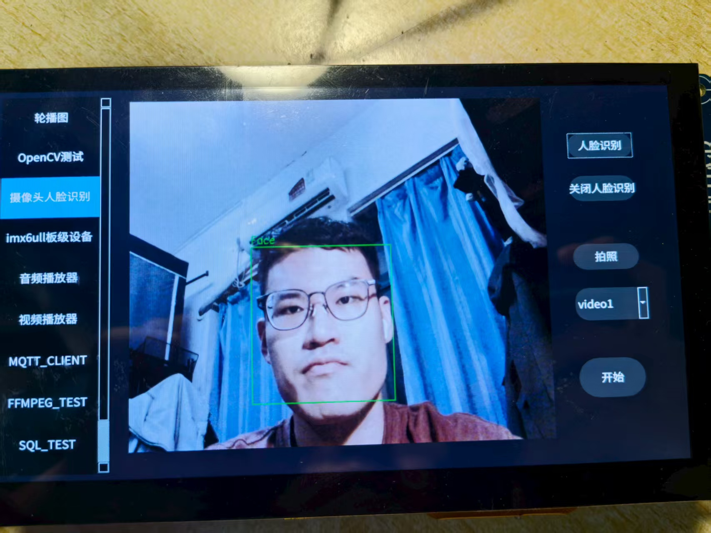

# smart_terminal

## 概述：

本项目是基于 https://github.com/Acoucou/imx6ull_project  项目做的二次开发，首先修改了相关makefile文件配置和ubuntu库文件配置，使得该项目的**基本功能**能够正常实现。之后，在此基础上实现了**视频局域网广播功能**和**SQLite时钟定时功能**，并补足了该项目初版时由于缺少摄像头ov5640而导致缺少相关**摄像头硬件验证**的问题，此外，还修改了**icm20608硬件驱动配置**，使之能够正常运行。如有相关问题，可发邮件至22331171@zju.edu.cn进行交流。

最新版本的 readme 加入了**对代码思想的详细说明**。

## 项目目的

1、基于arm-Linux开发一款嵌入式智能终端

2、集合轮播图、OpenCV图像处理、摄像头驱动及opencv人脸识别、板级硬件（LED灯、蜂鸣器、光距离红外、加速度计）、本地音频播放、本地视频播放、MQTT物联网传输、UDP视频流广播和SQLite定时等各种模块，可用于智能硬件的各种场景

## 项目架构


常见的项目架构如下：

### 项目配置（config）

.pro文件

.pri文件

config.h文件

### 硬件层（base层）

提供连通硬件各种接口，底层接口。可以再按底层驱动方式进行细分类。可分类如下：

字符设备、块设备、网络设备

### 中间控制层（middle control层）

提供各种APP层需要的**接口（API）函数**，可细分如下：

open sources(开源库)

network（网络接口）

hardware（硬件读写）

media（媒体，音视频等）

### APP层（UI表单层）

APP层逻辑编写，如各种控制事件，UI交互逻辑

### **项目资源（resources）**

项目的资源管理，如图片，样式，字体库等等。可分类如下：

img、style、font

以上框架是笔者个人理解，仅做参考

## 项目移植

### 1、开发板网络连接

本项目涉及到通信，因此需要做好开发板的局域网连接，由于笔者所处的环境中均是使用的无线校园网上网，因此采用了**电脑 WiFi 上网，开发板和电脑直连**的方式连接局域网。网络拓扑结构如下：


虚拟机中设置两个网卡，一个网卡为桥接模式，另一个网卡为NAT模式。桥接模式的网卡选择桥接至外部网线中。最终可实现开发板、虚拟机和主机三者之间的通信，并且虚拟机和主机均可上网。

### 2、文件传输

虚拟机和主机之间的文件传输可使用**FileZilla Client软件**，需要设置虚拟机能上网网卡的ip。虚拟机和开发板之间的文件传输可使用 **tftp** 或 **nfs** 协议。tftp适用于传输小文件，nfs适用于大文件和工程传输，命令示例如下：

```
tftp -g -r test.c（文件名） 192.168.10.100
```

```
mount -t nfs -o nolock,nfsvers=3 192.168.10.100:/home/alientek/linux/nfs（虚拟机共享文件夹路径） files/（开发板需要挂载的文件路径）
```

### 3、makefile文件修改

当在自己的配置环境中移植该工程时，由于本工程的makefile在编译部分第三方库时使用的是绝对路径，因此要对arm和x86文件夹下的makefile中的对应路径进行修改。可进行如下的更换：

```
/home/coucou/Desktop/my_project  换为 /home/alientek/project_1/imx6ull_project-master
/home/coucou/linux/opencv-3.4.1 换为 /home/alientek/opencv/opencv-3.4.1
/home/coucou/linux/qtmqtt-5.12.9 换为 /home/alientek/qtmqtt/qtmqtt-5.12.9
/linux/opencv-3.4.1 换为 /opencv/opencv-3.4.1

以下为arm中多出的：
/home/coucou/linux/qt/qt-everywhere-src-5.12.9 换为 /home/alientek/qt5.12.9/qt-everywhere-src-5.12.9
/home/coucou/linux/qt/tslib-1.21 换为 /home/alientek/linux/IMX6ULL/tool/tslib-1.21
/home/coucou/linux/gcc-linaro-7.5.0-2019.12-x86_64_arm-linux-gnueabihf/arm-linux-gnueabihf/include/c++/7.5.0 换为 /home/alientek/linux/tool/arm-linux-gnueabihf-gcc/gcc-linaro-4.9.4-2017.01-x86_64_arm-linux-gnueabihf/arm-linux-gnueabihf/include/c++/4.9.4

/home/coucou/linux/gcc-linaro-7.5.0-2019.12-x86_64_arm-linux-gnueabihf/arm-linux-gnueabihf/include 换为 /home/alientek/linux/tool/arm-linux-gnueabihf-gcc/gcc-linaro-4.9.4-2017.01-x86_64_arm-linux-gnueabihf/arm-linux-gnueabihf/include
/home/coucou/linux/gcc-linaro-7.5.0-2019.12-x86_64_arm-linux-gnueabihf/lib/gcc/arm-linux-gnueabihf/7.5.0/include-fixed 换为 /home/alientek/linux/tool/arm-linux-gnueabihf-gcc/gcc-linaro-4.9.4-2017.01-x86_64_arm-linux-gnueabihf/lib/gcc/arm-linux-gnueabihf/4.9.4/include-fixed

/home/coucou/linux/gcc-linaro-7.5.0-2019.12-x86_64_arm-linux-gnueabihf/lib/gcc/arm-linux-gnueabihf/7.5.0/include 换为 /home/alientek/linux/tool/arm-linux-gnueabihf-gcc/gcc-linaro-4.9.4-2017.01-x86_64_arm-linux-gnueabihf/lib/gcc/arm-linux-gnueabihf/4.9.4/include

/home/coucou/linux/gcc-linaro-7.5.0-2019.12-x86_64_arm-linux-gnueabihf/arm-linux-gnueabihf/libc/usr/include 换为 /home/alientek/linux/tool/arm-linux-gnueabihf-gcc/gcc-linaro-4.9.4-2017.01-x86_64_arm-linux-gnueabihf/arm-linux-gnueabihf/libc/usr/include

/linux/qt/qt-everywhere-src-5.12.9 换为 /qt5.12.9/qt-everywhere-src-5.12.9
```

### 4、第三方库移植

本实验中额外用到的第三方库主要有opencv、mqtt。这两个库可参照原作者的库文件，结合网上的资料进行移植，主要可以分为./config、make、make install三步。此外，还需要用到gphoto2和gtk3库。**注意，编译这些库文件时需要用到交叉编译**。配置交叉编译环境，并在交叉编译时制定ARCH和CROSS_COMPLIE，也即：

```
ARCH=arm CROSS_COMPILE=arm-linux-gnueabihf-
```

当交叉编译完成后，需要将第三方库放置于开发板的指定位置，并设置环境变量，运行QT编译出的build文件夹下的arm可执行文件。例如命令如下：

```
export LD_LIBRARY_PATH=/home/alientek/gphoto2/:/home/alientek/gtk3/
cd /home/alientek/project_1/imx6ull_project-master/build-project-ATK_I_MX6U-Debug/
./project
```

### 5、x86和arm环境下工程构建

当在x86上运行时，在project.pro文件中采用如下头文件和库文件路径：

```
INCLUDEPATH += /home/alientek/opencv/opencv-3.4.1/build/include
LIBS +=  -L/home/alientek/opencv/opencv-3.4.1/build/lib/ -lopencv_core -lopencv_highgui -lopencv_imgproc -lopencv_videoio -lopencv_imgcodecs -lopencv_core -lopencv_calib3d -lopencv_features2d -lopencv_video -lopencv_ml -lopencv_objdetect -lopencv_flann

#mqtt lib
unix:!macx: LIBS += -L$$PWD/lib/x86_qtmqtt/lib/ -lQt5Mqtt
INCLUDEPATH += $$PWD/lib/x86_qtmqtt/src/.
DEPENDPATH += $$PWD/lib/x86_qtmqtt/.
```

当在arm上运行时，在project.pro文件中采用如下头文件和库文件路径：CONFIG += link_pkgconfig

```
PKGCONFIG += opencv
PKGCONFIG += gtk+-3.0
INCLUDEPATH += /opt/fsl-imx-x11/4.1.15-2.1.0/sysroots/cortexa7hf-neon-poky-linux-gnueabi/usr/include

#mqtt lib
unix:!macx: LIBS += -L$$PWD/lib/arm_qtmqtt/lib/ /home/alientek/project_1/imx6ull_project-master/project/lib/arm_qtmqtt/lib/libQt5Mqtt.so.5.12.9
INCLUDEPATH += $$PWD/lib/arm_qtmqtt/src/.
DEPENDPATH += $$PWD/lib/arm_qtmqt/.
```

### 6、gdb调试

（1）开发板上运行gdbserver，执行如下命令：

```
gdbserver 192.168.10.100:2001 gdbtest //启动开发板上的 gdbserver
```

虚拟机上通过如下命令启动gdb：

```
arm-linux-gdb gdbtest
```

之后在(gdb)行输入如下命令连接到开发板上：

```
target remote 192.168.1.50:2001 //连接到开发板上
```

连接成功之后，可用常见的gdb命令进行调试。如l、b、c、n等

此外，还可以使用**backtrace、addr2line、objdump、readelf**等工具进行调试。

（2）还可以利用虚拟机上的vscode进行调试，具有图形化界面的便利性，但这时就只能进行断点调试，无法利用上一行的加粗的工具了

vscode中调试需要配置launch.json文件，配置该文件的如下项目：

①、name：调试的项目名
②、program：需要调试的应用程序可执行文件路径。
③、cwd：需要调试的应用程序源码路径。
④、miDebuggerPath：此项需要手动添加，用于指定所使用的交叉编译器 gdb 路径。
⑤、miDebuggerServerAddress：此项需要手动添加，远程 gdbserver 服务器地址。

### 7、linux内核模块开发与裁剪

当把linux内核的驱动以module的格式写好之后，交叉编译会生成.ko文件，此时交叉编译需要指定内核环境，需要与开发板的内核环境保持一致，包括u-boot、zImage、rootfs、dtb都需要保持一致，否则编译好的ko驱动会无法在开发板上运行。

内核的裁剪可以从删减自启过程中不需要的驱动入手，可从makefile入手，也可从图形化配置入手，具体命令如下：

```
make ARCH=arm CROSS_COMPILE=arm-linux-gnueabihf- distclean

make imx_alientek_emmc_defconfig ARCH=arm CROSS_COMPILE=$CROSS_COMPILE --defconfig=arch/arm/configs/imx_alientek_emmc_defconfig

make ARCH=arm CROSS_COMPILE=arm-linux-gnueabihf- menuconfig

make ARCH=arm CROSS_COMPILE=arm-linux-gnueabihf- all -j16
```

### 8、工程说明

arm和x86文件夹包含对应架构下的库文件，video_client文件夹包含MQTT客户端项目，project文件夹为主工程，两个build文件夹包含两种架构下的编译结果文件

### 9、代码流程分析

main.cpp --> mainwidget.cpp（运行构造函数与windows_init()函数，通过WidgetItemData数据结构、饥饿加载和工厂模式方法，简化程序逻辑以及增加程序的解耦性与可扩展性，默认运行第一个子窗口） --> listWidget的信号函数 currentRowChanged 驱动具体的子窗口

依次介绍各子窗口：

#### 9.1 banna类（轮播图子窗口）

##### 一、核心数据结构：`BannaData`（隐式定义）

代码中未显式贴出`BannaData`的结构体定义，但通过`initValue`的初始化逻辑可反推其作用 ——**封装单个轮播项的所有关联资源**，实现 “数据与逻辑绑定”，也即使用双向链表思想。其隐含结构如下：

```cpp
struct BannaData {
    QPushButton* pushButton;       // 对应轮播指示器按钮（如ui->pushButtonFirst）
    QLabel* currentImageLabel;     // 当前轮播图的显示标签（如ui->labelFirst）
    QLabel* nextImageLabel;        // 下一张图的标签（用于定义动画结束位置）
    QLabel* preImageLabel;         // 上一张图的标签（用于定义动画结束位置）
    QPropertyAnimation* proAnimation; // 控制当前标签位置的属性动画
};
```

`BannaData`的核心价值是：将 “指示器按钮、图片标签、动画” 三者绑定，避免分散管理导致的逻辑混乱，后续对轮播项的操作（如动画设置、图层调整）只需操作`BannaData`即可。

##### 二、核心函数解析（按功能分类）

代码可分为「初始化」「图片加载」「轮播控制」「图层管理」四大模块，以下逐一解析关键函数。

###### 模块 1：初始化（`initValue`）—— 构建轮播的 “骨架”

`initValue`是轮播组件的入口函数，负责初始化所有资源（定时器、按钮、动画、数据列表），为轮播奠定基础。其核心逻辑分 7 步：

1. **自动轮播定时器初始化**
   创建`changeImageTimer`定时器，绑定`slot_changeImageTimer`槽函数，设置轮播间隔（由`BannaSpace::INTERVAL_TIMER`定义，注释提为 3 秒）并启动，实现 “每 3 秒自动切换”。

```cpp
changeImageTimer = new QTimer(this);
connect(changeImageTimer, SIGNAL(timeout()), this, SLOT(slot_changeImageTimer()));
changeImageTimer->setInterval(BannaSpace::INTERVAL_TIMER); // 如3000ms
changeImageTimer->start();
```

2. **指示器按钮分组**
   将 5 个指示器按钮（`pushButtonFirst`~`pushButtonFifth`）加入`buttonGroup`，隐含 “互斥选中” 逻辑（同一时间只有一个按钮被选中，对应当前显示的轮播图）。

```cpp
buttonGroup.addButton(ui->pushButtonFirst);
// ... 加入其他4个按钮
```

3. **初始图层调整**
   通过`raise()`（置顶）和`lower()`（置底）调整标签初始层级，避免默认遮挡：

```cpp
ui->labelThird->raise();  // 初始让第3张图置顶显示
ui->labelFifth->lower();  // 初始让第5张图置底
```

4. **初始化`BannaData`列表**
   为 5 个轮播项分别创建`BannaData`对象，绑定 “指示器按钮 - 图片标签 - 动画”，并加入`bannaDataList`列表统一管理。
   例如第 1 个轮播项的绑定逻辑：

```cpp
BannaData bannaData;
bannaData.pushButton = ui->pushButtonFirst;       // 绑定第1个指示器按钮
bannaData.currentImageLabel = ui->labelFirst;     // 绑定第1张图的标签
bannaData.nextImageLabel = ui->labelSecond;       // 下一张图是第2张
bannaData.preImageLabel = ui->labelFifth;         // 上一张图是第5张（形成循环）
bannaData.proAnimation = new QPropertyAnimation(ui->labelFirst, BannaSpace::ANIMATION_GEOMETRY); // 创建位置动画
bannaDataList.append(bannaData);                  // 加入列表
```

关键细节：5 个轮播项通过`nextImageLabel`和`preImageLabel`形成**闭环循环**（第 5 张的下一张是第 1 张，第 1 张的上一张是第 5 张）。

5. **动画配置与分组**
   为每个轮播项的动画设置 “时长” 和 “缓动曲线”，并将所有动画加入`animationGroup`（`QParallelAnimationGroup`），实现 “多标签动画同步执行”：

```cpp
for(int i = 0; i < bannaDataList.size(); i++)
{
    bannaDataList.at(i).currentImageLabel->installEventFilter(this); // 安装事件过滤器（预留交互扩展）
    bannaDataList.at(i).proAnimation->setDuration(BannaSpace::ANIMATION_DURTION); // 动画时长（如200ms）
    bannaDataList.at(i).proAnimation->setEasingCurve(QEasingCurve::BezierSpline); // 贝塞尔曲线缓动（动画更流畅）
    animationGroup.addAnimation(bannaDataList.at(i).proAnimation); // 加入并行动画组
}
```

6. **加载轮播图片**
   定义图片路径列表，调用`addAnimationPixmap`为每个标签设置背景图片（通过样式表实现）。

7. **交互按钮置顶**
   将左右切换按钮（`pushButtonLeft`/`pushButtonRight`）置顶，避免被轮播图遮挡，保证用户可点击。

###### 模块 2：图片加载（`addAnimationPixmap`）—— 为轮播 “填充内容”

负责将图片路径列表与轮播标签一一绑定，通过 Qt 样式表（QSS）设置标签背景图，实现 “图片与标签的关联”。

```cpp
void banna::addAnimationPixmap(QList<QString> &listPixmap)
{
    if(listPixmap.size() != bannaDataList.size()) return; // 校验：图片数量必须与轮播项一致（避免越界）

    for(int i = 0; i < bannaDataList.size(); i++)
    {
        // 用QSS设置标签背景图（BannaSpace::STYLE_SHEET是预定义的样式模板，如"border-image:url(%1);"）
        QString styleSheet = BannaSpace::STYLE_SHEET.arg(listPixmap.at(i));
        bannaDataList.at(i).currentImageLabel->setStyleSheet(styleSheet);
    }
}
```

关键：通过`arg()`函数动态替换样式表中的图片路径，避免硬编码，提高灵活性。

###### 模块 3：轮播控制（定时器 + 按钮槽函数）—— 触发轮播动作

轮播触发分为 “自动触发” 和 “手动触发”，核心是**避免动画重复执行**（判断`animationGroup`是否在运行）。

**1. 自动触发：`slot_changeImageTimer`（定时器槽函数）**

每 3 秒触发一次，若当前无动画运行，则执行 “向右切换”（`setNextAnimation`）：

```cpp
void banna::slot_changeImageTimer()
{
    if(animationGroup.state() != QParallelAnimationGroup::Running) // 动画未在运行
    {
        this->setNextAnimation(); // 自动向右轮播
    }
}
```

**2. 手动触发：左右按钮槽函数**

- 左按钮（`on_pushButtonLeft_clicked`）：触发 “向左切换”（`setPreAnimation`）；
- 右按钮（`on_pushButtonRight_clicked`）：触发 “向右切换”（`setNextAnimation`）；
- 核心校验：同样判断动画是否在运行，避免快速点击导致的动画混乱。

```cpp
void banna::on_pushButtonLeft_clicked()
{
    if(animationGroup.state() != QParallelAnimationGroup::Running)
    {
        this->setPreAnimation(); // 手动向左轮播
    }
}
```

###### 模块 4：动画与图层管理（核心逻辑）

轮播的 “视觉流畅性” 依赖两个关键函数：`setNextAnimation`/`setPreAnimation`（动画设置）和`sortGeometry`（图层排序），以及`getMaxGeometryIndex`（位置判断）。

**1. 位置判断：`getMaxGeometryIndex`**

通过标签的`geometry().x()`（x 轴坐标）获取 “最右侧标签” 的索引 —— 轮播是左右移动，x 坐标越大表示标签越靠右，该函数为后续图层排序提供依据。

```cpp
int banna::getMaxGeometryIndex(const QList<BannaData> &listData)
{
    int maxPosX = 0;
    int maxIndex = 0;
    for(int i = 0; i < listData.size(); i++)
    {
        int geometryX = listData.at(i).currentImageLabel->geometry().x();
        if(maxPosX < geometryX) // 找到x坐标最大的标签
        {
            maxPosX = geometryX;
            maxIndex = i;
        }
    }
    return maxIndex;
}
```

**2. 动画设置：`setNextAnimation`（向右）与`setPreAnimation`（向左）**

通过`QPropertyAnimation`控制标签的`geometry`（位置属性），定义动画的 “起始位置” 和 “结束位置”，然后启动并行动画组。

- **向右轮播（`setNextAnimation`）**：每个标签的动画结束位置 = 其`preImageLabel`（上一张图）的当前位置（即标签向左移动到上一张图的位置）；
- **向左轮播（`setPreAnimation`）**：每个标签的动画结束位置 = 其`nextImageLabel`（下一张图）的当前位置（即标签向右移动到下一张图的位置）；

以向右轮播为例：

```cpp
void banna::setNextAnimation()
{
    for(int i = 0; i < bannaDataList.size(); i++)
    {
        // 动画起始位置：标签当前的位置
        bannaDataList.at(i).proAnimation->setStartValue(bannaDataList.at(i).currentImageLabel->geometry());
        // 动画结束位置：标签的“上一张图标签”的当前位置（实现向右轮播视觉效果）
        bannaDataList.at(i).proAnimation->setEndValue(bannaDataList.at(i).preImageLabel->geometry());
    }
    animationGroup.start(); // 同步执行所有标签的动画
    this->sortGeometry(true); // 动画后调整图层（isNextFlage=true表示向右轮播）
}
```

**3. 图层排序：`sortGeometry`（核心中的核心）**

轮播图的 “无遮挡显示” 依赖图层层级控制（`raise()`置顶、`lower()`置底）。该函数根据标签的 x 坐标（位置）和轮播方向（`isNextFlage`），分 5 个优先级调整图层，同时更新指示器按钮的选中状态。

`sortGeometry` 函数本质是一个 **“按位置排序 + 按方向分优先级” 的图层调度器 **，其逻辑链可简化为：

1. 拷贝数据 → 避免破坏原列表；
2. 循环找 “最右标签” → 按 x 坐标确定处理顺序；
3. 按优先级 + 方向调整层级 → 让 “当前显示图” 置顶；
4. 同步按钮状态 → 让用户感知当前轮播位置；
5. 二次置顶 + 按钮置顶 → 确保视觉和交互正确。

关键细节：

- `isNextFlage=true`（向右轮播）：第 2 优先级（`countNumber=1`）的标签置顶，对应当前显示图；

- `isNextFlage=false`（向左轮播）：第 4 优先级（`countNumber=3`）的标签置顶，对应当前显示图；

- 每次排序后移除已处理的标签，直到`listData`为空，确保所有标签层级都被正确调整。

  switch 中每个 case 的作用如下：

  | countNumber | 对应宏      | 处理逻辑（分轮播方向）                                       | 核心目的                                                     |
  | ----------- | ----------- | ------------------------------------------------------------ | ------------------------------------------------------------ |
  | 0           | SORT_FIRST  | 无论方向，直接调用 `lower()`（置底）                         | 最靠右的标签（轮播后会隐藏）沉到最下层，不影响其他标签显示   |
  | 1           | SORT_SECOND | 1. 若`isNextFlage=true`（向右轮播）： - 记录该标签为`topImageLabel`（当前显示图） - 对应指示器按钮设为`Checked`（选中） 2. 无论方向，调用`raise()`（置顶方向） | 向右轮播时，该优先级的标签是 “当前要显示的图”，需置顶并同步按钮状态 |
  | 2           | SORT_THIRD  | 无论方向，直接调用 `raise()`（置顶方向）                     | 中间层级标签，保证不被底层遮挡，同时不覆盖 “当前显示图”      |
  | 3           | SORT_FOURTH | 1. 若`isNextFlage=false`（向左轮播）： - 记录该标签为`topImageLabel`（当前显示图） - 对应指示器按钮设为`Checked`（选中） 2. 无论方向，调用`lower()`（置底方向） | 向左轮播时，该优先级的标签是 “当前要显示的图”，需置顶并同步按钮状态 |
  | 4           | SORT_FIFTH  | 1. 若`isNextFlage=false`（向左轮播）：调用`raise()` 2. 若`isNextFlage=true`（向右轮播）：调用`lower()` | 最靠左的标签，根据方向调整层级，确保与整体轮播视觉一致       |

##### 三、完整轮播流程（以自动向右轮播为例）

1. **初始化阶段**：`initValue`初始化定时器、`BannaData`列表、动画组，`addAnimationPixmap`加载图片，初始显示第 3 张图；
2. **自动触发**：定时器每 3 秒触发`slot_changeImageTimer`，判断动画未运行则调用`setNextAnimation`；
3. **动画执行**：`setNextAnimation`为每个标签设置 “当前位置→上一张图位置” 的动画，启动`animationGroup`同步执行；
4. **图层调整**：`sortGeometry(true)`根据 x 坐标排序图层，置顶当前显示图，更新指示器按钮选中状态；
5. **循环闭环**：第 5 张图向右轮播时，其`preImageLabel`是第 1 张图，动画结束后切换到第 1 张图，实现无限循环。

##### 四、核心设计原理与思想

这段代码的设计非常贴合 Qt 的 “组件化” 和 “面向对象” 思想，核心可总结为 5 点：

###### 1. 数据封装思想：用`BannaData`实现 “资源聚合”

将每个轮播项的 “指示器按钮、图片标签、动画” 封装到`BannaData`中，避免分散管理（如单独维护 5 个按钮、5 个标签、5 个动画）。后续对轮播项的操作（如设置动画、调整图层）只需遍历`bannaDataList`，代码更简洁、可维护性更高。

###### 2. 动画同步思想：用`QParallelAnimationGroup`保证 “视觉一致性”

轮播的流畅性依赖 “所有标签同时移动”，`QParallelAnimationGroup`能让多个`QPropertyAnimation`并行执行，避免单个标签动画延迟导致的视觉错位。同时通过`QEasingCurve::BezierSpline`缓动曲线，让动画过渡更自然（非匀速移动）。

###### 3. 状态控制思想：避免 “动画重复触发”

所有轮播触发逻辑（定时器、按钮点击）都先判断`animationGroup.state() != Running`，确保同一时间只有一个动画在执行。这种 “状态校验” 能避免快速点击或定时器叠加导致的动画混乱、界面卡顿。

###### 4. 图层管理思想：用`raise()`/`lower()`解决 “遮挡问题”

轮播图是多个标签叠加显示，若不调整层级，右侧标签会遮挡左侧标签。`sortGeometry`通过 x 坐标动态排序图层，确保当前显示图置顶，其他图按逻辑置底，完全符合用户视觉预期。

###### 5. 配置化思想：用`BannaSpace`常量实现 “灵活修改”

轮播间隔（`INTERVAL_TIMER`）、动画时长（`ANIMATION_DURTION`）、图片路径（`FIRST_IMAGE_PATH`）等都通过`BannaSpace`的常量定义，而非硬编码。若需修改轮播速度或替换图片，只需修改常量值，无需改动核心逻辑，扩展性极强。

#### 9.2 opencv类（图像处理子窗口）（部分算子分析）

这段代码是一个基于 **Qt GUI 框架 + OpenCV 图像处理库** 的图像处理工具类（`opencv`类），核心功能是通过可视化界面（按钮交互）实现多种经典图像处理算法，并实时展示处理结果。其本质是 “**将底层图像处理算法与上层 GUI 交互结合**”，让用户通过点击按钮即可触发算法，直观查看原始图与处理后的对比效果。

##### 一、核心架构：Qt 与 OpenCV 的协同逻辑

代码的基础是 “**Qt 负责交互与显示，OpenCV 负责算法计算**”，两者通过 “图像格式转换” 衔接，形成完整的数据流闭环：

| 模块           | 技术依赖                            | 核心作用                                                     |
| -------------- | ----------------------------------- | ------------------------------------------------------------ |
| 界面交互与显示 | Qt（QWidget、QLabel、QPushButton）  | 提供按钮（触发功能）、标签（显示图像）、文件选择对话框（加载图片） |
| 图像处理算法   | OpenCV（Mat、cvtColor、梯度计算等） | 实现灰度化、边缘检测、直方图等算法，处理图像数据（存储为`Mat`格式） |
| 图像格式转换   | Qt（QImage、QPixmap）+ OpenCV       | 解决 “OpenCV 的 BGR 格式” 与 “Qt 的 RGB 格式” 不兼容问题，确保图像正常显示 |

###### 关键衔接点：图像格式转换

OpenCV 读取的图像（`Mat`）默认是 **BGR 通道顺序**，而 Qt 显示图像（`QImage`）默认是 **RGB 通道顺序**，若不转换会导致图像偏色（如蓝色变红色）。代码中通过固定逻辑解决该问题：

```cpp
// 1. OpenCV Mat（BGR）转 Qt QImage（RGB）
Mat temp;
cvtColor(srcImg, temp, CV_BGR2RGB);  // 核心：BGR → RGB通道互换
// 2. 将Mat数据映射为QImage（参数：数据指针、宽、高、行字节数、图像格式）
QImage Qtemp = QImage((const unsigned char*)(temp.data), 
                      temp.cols, temp.rows, 
                      temp.step,  // Mat的行字节数（确保数据连续）
                      QImage::Format_RGB888);  // 24位RGB格式
// 3. QImage转QPixmap，显示到Qt的QLabel上
ui->label->setPixmap(QPixmap::fromImage(Qtemp));
```

##### 二、核心功能模块与算法原理

代码按 “**基础处理 → 特征提取 → 高级检测**” 的逻辑组织功能，每个按钮对应一个独立的图像处理算法，以下是核心模块的原理解析：

###### 模块 1：基础图像加载与预处理

**1. 图片加载（`seletpic_clicked`）**

- **功能**：通过 Qt 的`QFileDialog`让用户选择本地图片，加载为 OpenCV 的`Mat`格式（`srcImg`），并转为灰度图（`grayImg`）。
- 原理：
  1. `QFileDialog::getOpenFileName`获取图片路径（Qt 字符串`QString`）；
  2. 转为`std::string`，用 OpenCV 的`imread`读取图片到`srcImg`；
  3. `cvtColor(srcImg, grayImg, CV_BGR2GRAY)`将彩色图转为灰度图（后续算法多基于灰度图计算）；
  4. 调用格式转换逻辑，将原始图显示到`ui->label`。

**2. 灰度化（`grayProcess_clicked`）**

- **功能**：将彩色图按 “人眼视觉权重” 转为灰度图（手动实现，未直接用 OpenCV 的`cvtColor`）。
- **核心原理**：
  人眼对绿色敏感度最高（~59%），红色次之（~30%），蓝色最低（~11%），因此用加权公式计算每个像素的灰度值：`gray = 0.11*B + 0.59*G + 0.3*R`
  （`srcImg.at<Vec3b>(i,j)[0]`是 B 通道，`[1]`是 G 通道，`[2]`是 R 通道）
- **细节**：用`grayImg.create`创建单通道灰度图（`CV_8UC1`：8 位无符号单通道），用`at<uchar>`访问灰度像素值。

**3. 灰度直方图（`grayLeval_clicked`）**

- **功能**：统计灰度图中 “每个灰度级（0~255）的像素数量”，并可视化成直方图。
- 原理（辅助函数`gray_to_level`）：
  1. **统计像素分布**：用`QVector<int> pixel(256,0)`记录每个灰度级（0~255）的像素个数；
  2. **绘制直方图**：创建 350x256 的空白图（`gray_level`），以 “灰度级为 x 轴，像素数量为 y 轴”，像素数量越多，直方图的黑色柱越高（`gray_level.at<uchar>(j,i) = 0`表示黑色）；
  3. **归一化**：因不同图片的像素总数不同，用`320.*pixel[i]/max_rows`将像素数量缩放到 0~320 的范围（适配直方图高度）。

**4. 灰度均衡（`grayBalance_clicked`）**

会用到灰度累积分布函数，可以增强图像的灰度对比度。

###### 模块 2：图像增强与边缘检测（核心算法）

边缘检测是图像特征提取的基础，核心思想是 “**边缘处像素灰度值突变，通过计算梯度捕捉这种突变**”。代码实现了 5 种经典边缘检测算法：

**1. 梯度锐化（`gradSharpen_clicked`）**

- **原理**：计算 “水平 / 垂直方向的灰度梯度”（梯度越大，边缘越明显），再用 “原始灰度 - 梯度” 得到锐化图（突出边缘细节）。
  梯度计算：`grad = max(|当前像素 - 下方像素|, |当前像素 - 右侧像素|)`（取水平 / 垂直梯度的最大值）。

**2. 拉普拉斯锐化（`laplaceSharpen_clicked`）**

- **原理**：拉普拉斯算子是 “二阶导数”，能放大灰度突变（边缘），公式为：
  `laplace = -4*当前像素 + 上像素 + 下像素 + 左像素 + 右像素`
  锐化图：`gray2Img = 5*当前像素 - 上像素 - 下像素 - 左像素 - 右像素`（本质是 “原始像素 + 拉普拉斯梯度”，增强边缘）。

**3. Roberts 边缘检测（`robertsEdge_clicked`）**

- **原理**：用 2x2 模板计算 “对角线方向的梯度”，捕捉斜向边缘，公式为：
  `grad = |(i,j) - (i+1,j+1)| + |(i+1,j) - (i,j+1)|`（两个对角线的灰度差之和）。

**4. Sobel 边缘检测（`sobelEdge_clicked`）**

- 原理：用 3x3 模板分别计算 “x 方向（水平）梯度” 和 “y 方向（垂直）梯度”，再求和得到总梯度，能有效捕捉水平 / 垂直边缘：
  - x 方向梯度（突出垂直边缘）：`f_x = |下方3像素和 - 上方3像素和|`（带权重 2，增强中心附近梯度）；
  - y 方向梯度（突出水平边缘）：`f_y = |右侧3像素和 - 左侧3像素和|`；
  - 总梯度：`grad = f_x + f_y`。

**5. Canny 边缘检测（`Canny_clicked`）**

- 功能：最经典的边缘检测算法，抗噪性强，能得到 “细且连续的边缘”，代码手动实现了完整四步流程：
  1. **高斯滤波去噪**：用 3x3 高斯模板（权重如 0.751、0.123）平滑图像，减少噪声对边缘的干扰；
  2. **计算梯度与方向**：用 Sobel 算子算 x/y 梯度，再算梯度大小（`sqrt(f_x² + f_y²)`）和方向（`atan(f_y/f_x)`，映射到 0~180°）；
  3. **极大值抑制**：沿梯度方向比较相邻像素，只保留梯度最大的像素（将边缘 “细化” 为 1 像素宽）；
  4. 双阈值连接：
     - 高阈值（40）：大于高阈值的是 “强边缘”（直接保留，设为 255）；
     - 低阈值（10）：小于低阈值的是 “噪声”（直接丢弃，设为 0）；
     - 介于两者之间的 “弱边缘”：若与强边缘相邻（递归判断 8 邻域），则保留为边缘，否则丢弃。

##### 三、核心设计思想

这段代码的设计围绕 “**易用性、可维护性、原理透明性**” 展开，体现了 3 个关键思想：

###### 1. 模块化与单一职责

每个功能对应一个独立的槽函数，职责单一，例如：

- `seletpic_clicked`：只负责 “加载图片”；
- `grayProcess_clicked`：只负责 “彩色转灰度”；
- `Canny_clicked`：只负责 “Canny 边缘检测”。
  这种设计让代码结构清晰，后续新增算法（如高斯滤波）只需添加一个按钮和对应的槽函数，无需修改现有逻辑。

###### 2. 可视化交互与即时反馈

- **多标签显示**：用`ui->label`（原始图）、`ui->label_2`（中间结果，如梯度图）、`ui->label_3`（最终结果，如锐化图）分别显示不同阶段的图像，用户能直观对比处理效果；
- **平滑显示优化**：图像缩放用`Qt::KeepAspectRatio`（保持宽高比，避免拉伸变形）和`Qt::SmoothTransformation`（平滑缩放，减少锯齿）；
- **防溢出处理**：所有像素计算后用`Saturate_cast<uchar>`将值限制在 0~255（避免因计算溢出导致的图像异常，如负数值或大于 255 的数值）。

###### 3. 底层原理手动实现，拒绝 “黑盒调用”

代码没有直接依赖 OpenCV 的高阶封装函数（如`cv::Canny`、`cv::Sobel`），而是手动实现核心算法逻辑：

- 灰度化：手动写加权公式，而非`cvtColor(src, gray, COLOR_BGR2GRAY)`；
- Canny：手动实现高斯滤波、极大值抑制、双阈值连接，而非`cv::Canny`；
- 直方图：手动统计像素分布并绘制，而非`cv::calcHist`。
  这种设计更适合学习和演示 —— 不仅能看到最终效果，还能理解算法的底层计算逻辑。

##### 四、总结

这段代码的本质是 “**图像处理算法的 GUI 化封装**”：

- 技术上，通过 Qt 的信号槽机制（按钮点击→触发算法）和图像格式转换（Mat→QImage），解决了 “算法计算” 与 “界面显示” 的协同问题；
- 功能上，覆盖了 “基础预处理（灰度化、直方图）→ 增强（锐化）→ 特征提取（边缘检测）” 的完整图像处理流程；
- 思想上，以 “模块化、可视化、原理透明” 为核心，既适合作为图像处理的教学演示工具，也可扩展为更复杂的图像分析系统（如添加目标检测、图像分割）。

#### 9.3 faceDetect类（人脸识别子窗口）

这段代码是一个**基于 Qt（UI 交互）+ OpenCV（图像处理与人脸检测）的实时摄像头人脸检测程序**，核心功能是：扫描并选择摄像头设备、捕获实时视频流、用 Haar 级联分类器检测人脸并标记、支持拍照保存。整体设计围绕 “**跨平台适配 + 模块化交互 + 实时检测**” 展开，下面从 “核心架构、关键模块原理、设计思想” 三部分详细解析。

##### 一、核心架构：Qt 与 OpenCV 的协同逻辑

程序本质是 “**Qt 负责 UI 交互与设备管理，OpenCV 负责视频捕获与人脸检测**”，两者通过 “视频帧格式转换” 衔接，形成完整的数据流闭环：

| 模块              | 技术依赖                              | 核心作用                                                     |
| ----------------- | ------------------------------------- | ------------------------------------------------------------ |
| UI 交互与设备管理 | Qt（QWidget、QComboBox、QPushButton） | 提供摄像头选择下拉框、开始 / 关闭 / 拍照 / 检测按钮、图像显示标签，扫描跨平台摄像头设备 |
| 视频流捕获        | OpenCV（VideoCapture）                | 打开指定摄像头，实时读取视频帧（存储为`Mat`格式）            |
| 人脸检测          | OpenCV（Haar 级联分类器）             | 加载预训练人脸模型，对视频帧进行人脸检测，标记检测结果       |
| 图像格式转换      | Qt（QImage）+ OpenCV（Mat）           | 解决 “OpenCV 的 BGR 帧” 与 “Qt 的 RGB 显示” 不兼容问题，确保视频帧正常显示 |
| 状态控制          | Qt 信号槽 + 标志位（`cap_flag`）      | 控制摄像头启停、检测循环退出、按钮状态联动（如 “无图像时禁用拍照”） |

##### 二、关键模块原理解析

按 “初始化→摄像头管理→实时检测→交互控制” 的流程，拆解核心函数的逻辑：

###### 模块 1：初始化（构造函数、`layoutInit`、`scanCameraDevice`）

初始化是程序运行的基础，负责 “UI 布局设置、摄像头扫描、信号槽绑定”，为后续功能铺路。

**1. 构造函数（`faceDetect::faceDetect`）**

```cpp
faceDetect::faceDetect(QWidget *parent) : QWidget(parent), ui(new Ui::faceDetect)
{
    ui->setupUi(this);
    layoutInit();    // UI布局与控件属性初始化
    scanCameraDevice(); // 跨平台扫描摄像头设备
    // 绑定“人脸检测”“关闭检测”按钮的点击事件
    connect(ui->faceHaar, SIGNAL(clicked()), this, SLOT(faceHaar_clicked()));
    connect(ui->closeDetect, SIGNAL(clicked()), this, SLOT(closeDetect_clicked()));
}
```

- 核心：先初始化 UI 和摄像头，再绑定关键功能按钮的信号槽，确保 “点击按钮能触发对应逻辑”。

**2. UI 布局初始化（`layoutInit`）**

负责设置控件属性、初始化摄像头辅助类（`Camera`）、绑定交互信号槽，是 “UI 与功能联动” 的关键：

```cpp
void faceDetect::layoutInit()
{
    // 1. 屏幕分辨率适配（避免多屏设备显示异常）
    QList <QScreen *> list_screen = QGuiApplication::screens();
    // 2. 图像显示标签设置（自动拉伸，避免图像变形）
    ui->displayLabel->setScaledContents(true);
    // 3. 按钮属性初始化（文本、初始状态）
    ui->takePic->setText("拍照");
    ui->takePic->setEnabled(false); // 初始无图像，禁用拍照
    ui->start->setText("开始");
    ui->start->setCheckable(true);  // 支持“选中/未选中”状态（对应摄像头启停）
    // 4. 初始化摄像头辅助类（负责摄像头设备选择、视频流捕获）
    camera = new Camera(this);
    // 5. 绑定核心信号槽（UI交互→功能触发）
    connect(camera, SIGNAL(readyImage(QImage)), this, SLOT(showImage(QImage))); // 摄像头输出帧→显示
    connect(ui->start, SIGNAL(clicked(bool)), camera, SLOT(cameraProcess(bool))); // 开始/关闭→摄像头启停
    connect(ui->start, SIGNAL(clicked(bool)), this, SLOT(setButtonText(bool))); // 按钮状态→文本切换
    connect(ui->takePic, SIGNAL(clicked()), this, SLOT(saveImageToLocal())); // 拍照→保存图片
}
```

- 关键设计：
  - `ui->displayLabel->setScaledContents(true)`：确保视频帧自适应标签大小，避免拉伸变形；
  - `ui->takePic->setEnabled(false)`：初始无视频流时禁用拍照，防止用户误操作；
  - `Camera`类（未贴完整代码，但从调用看）：封装了摄像头设备选择、视频流读取逻辑，解耦 “设备管理” 与 “UI”。

**3. 跨平台摄像头扫描（`scanCameraDevice`）**

解决 “不同系统摄像头设备路径不同” 的问题，支持 Windows、Linux（Ubuntu/ARM 开发板），是程序 “跨平台可用性” 的核心：

```cpp
void faceDetect::scanCameraDevice()
{
#if win32 // Windows系统：默认摄像头设备索引为0
    ui->comboBox->addItem("windows摄像头0");
    connect(ui->comboBox, SIGNAL(currentIndexChanged(int)), camera, SLOT(selectCameraDevice(int)));
#else // Linux系统：摄像头设备节点为/dev/video0~2，动态检测存在的设备
    QFile file("/dev/video0");
    if (file.exists()) ui->comboBox->addItem("video0"); // 存在则添加到下拉框
    else { ui->displayLabel->setText("无摄像头设备"); return; }

    file.setFileName("/dev/video1");
    if (file.exists()) {
        ui->comboBox->addItem("video1");
        ui->comboBox->setCurrentIndex(1); // ARM开发板OV5640摄像头默认选video1
    }

    file.setFileName("/dev/video2");
    if (file.exists()) ui->comboBox->addItem("video2"); // ARM开发板USB摄像头选video2

#if !__arm__ // Ubuntu系统：USB摄像头默认选video0
    ui->comboBox->setCurrentIndex(0);
#endif
    // 下拉框选择变化→切换摄像头设备
    connect(ui->comboBox, SIGNAL(currentIndexChanged(int)), camera, SLOT(selectCameraDevice(int)));
#endif
}
```

- 跨平台逻辑：
  - Windows：简化处理，默认只有 “摄像头 0”（Windows 系统摄像头设备索引通常从 0 开始）；
  - Linux：通过`QFile`检测`/dev/video*`节点是否存在（Linux 下摄像头是字符设备，路径固定）；
  - ARM 开发板适配：区分 “板载摄像头（OV5640→video1）” 和 “USB 摄像头（video2）”，Ubuntu 默认选 USB 摄像头（video0）；
  - 下拉框联动：选择不同设备时，通过`selectCameraDevice`切换摄像头，确保用户可手动选择可用设备。

###### 模块 2：视频流显示与拍照（`showImage`、`setButtonText`、`saveImageToLocal`）

这三个函数负责 “视频帧显示、UI 状态同步、图片保存”，是用户与程序交互的直接反馈层。

**1. 视频帧显示（`showImage`）**

接收`Camera`类发来的`QImage`帧，显示到标签，并同步拍照按钮状态：

```cpp
void faceDetect::showImage(const QImage &image)
{
    ui->displayLabel->setPixmap(QPixmap::fromImage(image)); // 显示视频帧
    saveImage = image; // 保存当前帧，用于拍照
    // 有图像则启用拍照，无图像则禁用（避免空帧保存）
    ui->takePic->setEnabled(!saveImage.isNull());
}
```

- 关键：通过`saveImage`缓存当前帧，确保 “拍照时保存的是最新显示的帧”；通过`isNull()`判断帧有效性，避免无效操作。

**2. 按钮状态联动（`setButtonText`）**

根据 “开始 / 关闭” 按钮的选中状态，切换按钮文本并同步摄像头设备选择：

```cpp
void faceDetect::setButtonText(bool bl)
{
    if (bl) { // 按钮选中→启动摄像头
        camera->selectCameraDevice(ui->comboBox->currentIndex()); // 选择下拉框当前设备
        ui->start->setText("关闭"); // 文本切换为“关闭”
    } else { // 按钮未选中→关闭摄像头
        ui->takePic->setEnabled(false); // 禁用拍照
        ui->start->setText("开始"); // 文本切换为“开始”
    }
}
```

- 设计思想：“状态联动”—— 用户点击按钮时，不仅切换文本，还自动选择当前下拉框的摄像头设备，减少用户操作步骤；关闭摄像头后禁用拍照，避免无帧可拍。

**3. 拍照保存（`saveImageToLocal`）**

将缓存的`saveImage`保存到应用程序目录，格式为 PNG，并显示保存的图片：

```cpp
void faceDetect::saveImageToLocal()
{
    if (!saveImage.isNull()) { // 确保帧有效
        // 保存路径：应用程序所在目录/test.png（跨平台路径，避免硬编码）
        QString fileName = QCoreApplication::applicationDirPath() + "/test.png";
        qDebug()<<"正在保存"<<fileName<<"图片,请稍候..."<<endl;
        // 保存图片：格式PNG，质量等级-1（默认最高质量，无压缩）
        saveImage.save(fileName, "PNG", -1);
        // 显示保存的图片（反馈用户“保存成功”）
        ui->displayLabel->setPixmap(QPixmap::fromImage(QImage(fileName)));
        qDebug()<<"保存完成！"<<endl;
    }
}
```

- 关键：
  - 路径处理：用`QCoreApplication::applicationDirPath()`获取应用目录，避免 Windows/Linux 路径分隔符（`\`/`/`）问题，确保跨平台可用；
  - 保存参数：`save`函数的第三个参数`-1`表示 “使用默认质量”，PNG 格式下为无损压缩，保证图片清晰度。

###### 模块 3：核心功能 ——Haar 级联人脸检测（`faceHaar_clicked`）

这是程序的核心算法模块，基于 OpenCV 的 Haar 级联分类器实现实时人脸检测，流程为 “加载模型→打开摄像头→读取帧→检测人脸→标记并显示”：

```cpp
void faceDetect::faceHaar_clicked()
{
    String label = "Face"; // 人脸标签文本
    CascadeClassifier faceCascade; // Haar级联分类器对象
    // 1. 加载预训练人脸模型（关键：模型文件路径必须正确）
    faceCascade.load("../project/opencv_src/face-haar/haarcascade_frontalface_alt2.xml");
    if (faceCascade.empty()) { // 模型加载失败则退出
        qDebug()<<"Haar模型加载失败！"<<endl;
        return;
    }

    // 2. 打开摄像头（设备索引1，注意：此处硬编码，可优化为下拉框选择的索引）
    capture1.open(1);
    if (!capture1.isOpened()) { // 摄像头打开失败则退出
        qDebug()<<"摄像头打开失败！"<<endl;
        return;
    }

    Mat img, imgGray;
    vector<Rect> faces; // 存储检测到的人脸矩形框
    // 3. 实时视频帧处理循环
    while (1) {
        // 3.1 读取一帧视频
        capture1 >> img;
        if (img.empty()) continue; // 帧为空则跳过（避免崩溃）

        // 3.2 转灰度图（Haar检测用灰度图更高效：减少通道数，降低计算量）
        if (img.channels() == 3) cvtColor(img, imgGray, CV_RGB2GRAY);
        else imgGray = img; // 已为灰度图则直接使用

        // 3.3 人脸检测（核心函数：detectMultiScale）
        faceCascade.detectMultiScale(
            imgGray,        // 输入灰度图
            faces,          // 输出：检测到的人脸矩形框列表
            1.2,            // 缩放因子：每次搜索窗口扩大20%，平衡精度与速度
            6,              // 最小邻居数：保留至少6个相邻检测框的结果，减少误检
            0,              //  flags：默认0
            Size(0, 0)      // 最小人脸尺寸：不限制，检测所有大小的人脸
        );

        // 3.4 标记人脸（在原始彩色帧上画矩形框和标签）
        if (faces.size() > 0) { // 检测到人脸
            for (int i = 0; i < faces.size(); i++) {
                // 画绿色矩形框：Scalar(0,255,0)是BGR格式（绿色），线宽1，线型8
                rectangle(img, 
                          Point(faces[i].x, faces[i].y), 
                          Point(faces[i].x + faces[i].width, faces[i].y + faces[i].height), 
                          Scalar(0, 255, 0), 1, 8);
                // 加“Face”标签：位置在人脸框上方，字体大小0.5，绿色
                putText(img, label, Point(faces[i].x, faces[i].y -5), FONT_HERSHEY_SIMPLEX, 0.5, Scalar(0,255,0));
            }
        }

        // 3.5 格式转换：OpenCV Mat（BGR）→ Qt QImage（RGB），显示到标签
        if (img.type() == CV_8UC3) { // 3通道彩色图
            const uchar *pimg = (const uchar*)img.data;
            // 构造QImage：数据指针、宽、高、行字节数、RGB格式
            QImage qImage(pimg, img.cols, img.rows, img.step, QImage::Format_RGB888);
            ui->displayLabel->setPixmap(QPixmap::fromImage(qImage.rgbSwapped())); // rgbSwapped()：BGR→RGB
        } else if (img.type() == CV_8UC4) { // 4通道图（如带Alpha通道）
            const uchar *pSrc = (const uchar*)img.data;
            QImage qImage(pSrc, img.cols, img.rows, img.step, QImage::Format_ARGB32);
            ui->displayLabel->setPixmap(QPixmap::fromImage(qImage.copy()));
        }

        // 3.6 循环退出条件：按键触发（waitKey(1)等待1ms，有按键则退出）或cap_flag=true（关闭检测按钮触发）
        if (waitKey(1) != -1 || cap_flag) break;
    }
    // 4. 释放摄像头资源（避免内存泄漏）
    capture1.release();
}
```

###### Haar 级联检测核心原理

Haar 级联分类器是一种 “基于机器学习的目标检测算法”，核心思想是 “用大量正负样本训练模型，通过特征匹配快速定位目标（人脸）”：

1. **模型加载**：`haarcascade_frontalface_alt2.xml`是 OpenCV 预训练的 “正面人脸检测模型”，包含大量人脸特征（如眼睛、鼻子、嘴巴的灰度分布特征）；
2. **灰度转换**：Haar 特征基于灰度值差异计算，转灰度图可减少 1/3 的计算量，提升检测速度；
3. `detectMultiScale`参数：
   - `1.2`（缩放因子）：每次将搜索窗口扩大 20%，避免因人脸大小不同导致漏检；
   - `6`（最小邻居数）：只有当一个区域被至少 6 个相邻搜索窗口检测为 “人脸” 时，才判定为有效人脸，减少误检（如把树干误判为人脸）；
4. **结果标记**：用`rectangle`画绿色矩形框（用户直观看到检测结果），`putText`加 “Face” 标签，增强交互性；
5. **格式转换**：OpenCV 的`Mat`默认是 BGR 通道，Qt 的`QImage`默认是 RGB 通道，必须用`rgbSwapped()`互换通道，否则图像会偏色（如蓝色变红色）。

###### 检测循环退出控制（`closeDetect_clicked`）

通过`cap_flag`标志位控制检测循环退出，避免循环阻塞无法关闭：

```cpp
void faceDetect::closeDetect_clicked()
{
    capture1.release(); // 释放摄像头资源
    cap_flag = true;    // 设置标志位，触发循环退出
}
```

- 关键：若没有`cap_flag`，检测循环（`while(1)`）会一直运行，即使点击 “关闭检测” 按钮也无法退出，导致程序卡住。

##### 三、核心设计思想

这段代码的设计围绕 “**实用性、跨平台性、易用性**” 展开，体现了 4 个关键思想：

###### 1. 模块化与解耦

- 功能拆分：`Camera`类负责摄像头设备管理，`faceDetect`类负责 UI 交互和人脸检测，两者通过信号槽（`readyImage`）通信，避免 “设备管理” 与 “检测逻辑” 混在一起；
- 函数职责单一：`showImage`只负责显示帧，`saveImageToLocal`只负责保存图片，`faceHaar_clicked`只负责人脸检测，代码可维护性高（如修改保存路径只需改`saveImageToLocal`）。

###### 2. 跨平台适配

- 摄像头设备扫描：区分 Windows（默认 0）、Linux（`/dev/video*`）、ARM 开发板（板载 / USB 摄像头），确保程序在不同硬件上都能找到可用摄像头；
- 路径处理：用`QCoreApplication::applicationDirPath()`获取应用目录，避免硬编码路径（如`C:/test.png`只适用于 Windows），确保跨平台路径有效。

###### 3. UI 交互友好

- 状态联动：无图像时禁用拍照、按钮状态切换文本、检测到人脸时标记绿色框，用户无需猜测操作结果；
- 错误处理：模型加载失败、摄像头打开失败时输出调试信息（`qDebug`），便于开发定位问题；
- 显示优化：`displayLabel`自动拉伸、图片保存为 PNG（无损），提升用户体验。

###### 4. 算法与 UI 结合

- 实时性：`detectMultiScale`参数（1.2、6）平衡 “检测精度” 与 “速度”，确保实时视频流（约 25-30 帧 / 秒）不卡顿；
- 可视化：将抽象的 “人脸检测结果” 转化为 “绿色矩形框 + 标签”，普通用户也能直观理解检测效果，降低使用门槛。

##### 四、总结与可优化点

###### 总结

这段程序是 “Qt+OpenCV” 结合的典型案例：

- 技术上：用 Qt 解决 “UI 交互与跨平台”，用 OpenCV 解决 “视频捕获与人脸检测”，两者通过图像格式转换衔接；
- 功能上：覆盖 “摄像头选择→实时检测→拍照保存→检测关闭” 的完整流程，满足日常人脸检测需求（如简易考勤、人脸跟踪）；
- 思想上：模块化、跨平台、易用性设计，既适合作为学习案例，也可扩展为更复杂的系统（如添加人脸比对、拍照存档）。

###### 可优化点（现有代码的潜在问题）

1. **摄像头索引硬编码**：`faceHaar_clicked`中`capture1.open(1)`是硬编码，未使用下拉框（`comboBox`）选择的索引，可能导致用户选择了`video0`，但程序打开`video1`，设备不匹配；
2. **检测循环阻塞 UI**：`while(1)`检测循环是阻塞的，会卡住 Qt 的事件循环（如点击 “开始” 按钮后，界面无法拖动），可优化为 “多线程”（将检测逻辑放在子线程，主线程负责 UI）；
3. **模型路径硬编码**：`haarcascade_frontalface_alt2.xml`的路径是相对路径（`../project/opencv_src/...`），若程序运行目录改变，模型会加载失败，可优化为 “资源文件”（将模型嵌入程序，无需依赖外部文件）。

总之，这段代码的核心价值是 “**将复杂的人脸检测算法封装为简单的 UI 操作**”，让用户无需了解底层算法，只需点击按钮就能实现实时人脸检测，是 “技术落地” 的典型示例。

#### 9.4 imx6ullTest类（板级硬件子窗口）

这段代码是一个基于 **Qt + 嵌入式 Linux** 的 **IMX6ULL 开发板硬件测试工具**，核心功能是：实时采集两种传感器（AP3216C 三合一传感器、ICM20608 六轴传感器）数据、通过 UI 可视化显示（文本框 + 平滑曲线）、控制板载 LED 和蜂鸣器。其本质是 “**将嵌入式硬件的底层数据采集与 Qt 的上层可视化交互结合**”，让开发者通过直观的 UI 监控硬件状态、控制外设。

##### 一、核心架构：Qt 与嵌入式 Linux 的协同逻辑

代码的基础是 “**Qt 负责 UI 可视化与交互，嵌入式 Linux 负责硬件控制与数据采集**”，通过 “Qt 信号槽 + Linux sysfs 文件系统 + 传感器 I2C 通信” 形成闭环，具体架构如下：

| 模块            | 技术依赖                                  | 核心作用                                                     |
| --------------- | ----------------------------------------- | ------------------------------------------------------------ |
| UI 可视化与交互 | Qt（QMainWindow、Qt Charts、QPushButton） | 提供数据显示（文本框 + 曲线）、控制按钮（启停 / 清空 / LED / 蜂鸣器）、平滑曲线绘制 |
| 嵌入式硬件控制  | Linux sysfs 文件系统（QFile）             | 通过读写系统文件节点（如`/sys/class/leds/sys-led/brightness`）控制 LED / 蜂鸣器 |
| 传感器数据采集  | 自定义传感器类（Ap3216c、Icm20608）       | 封装 I2C 通信（AP3216C/ICM20608 常用 I2C 接口），定时采集数据并发送信号 |
| 数据同步与更新  | Qt 信号槽机制                             | 传感器数据变化时触发 UI 更新（文本框 + 曲线），按钮点击触发硬件控制 |

##### 二、关键模块原理解析

按 “**初始化→传感器数据处理→外设控制→UI 交互**” 的流程，拆解核心函数的逻辑：

###### 模块 1：初始化（构造函数、`chart_init`、`hardware_init`）

初始化是程序运行的基础，负责 “图表配置、硬件适配、信号槽绑定”，为后续数据采集和控制铺路。

**1. 构造函数（`imx6ullTest::imx6ullTest`）**

```cpp
imx6ullTest::imx6ullTest(QWidget *parent) : QMainWindow(parent), ui(new Ui::imx6ullTest)
{
    ui->setupUi(this);
    chart_init();       // 初始化Qt Charts（曲线显示）
    hardware_init();    // 初始化硬件（传感器+LED+蜂鸣器）
    m_timer = new QTimer(this); // 定时器（预留定时任务接口）
    m_timer->setSingleShot(false); // 非单次触发（可循环）

    // 绑定核心交互信号槽
    connect(ui->pushButton, SIGNAL(clicked()), this, SLOT(on_pushButton_clicked())); // AP3216C停止
    connect(ui->btnClear, SIGNAL(clicked(bool)), this, SLOT(slotBtnClear())); // 清空曲线
    connect(ui->btnStartAndStop, SIGNAL(clicked(bool)), this, SLOT(slotBtnStartAndStop())); // AP3216C启动
}
```

- 核心：先初始化 “可视化载体（图表）” 和 “硬件接口”，再绑定按钮与功能的关联，确保用户操作能触发对应逻辑。

**2. 图表初始化（`chart_init`）—— 传感器数据可视化核心**

负责创建 Qt Charts 组件，配置 “平滑曲线、坐标轴、图表样式”，实现 ALS（环境光）、IR（红外）、PS（接近）三种数据的实时曲线显示：

```cpp
void imx6ullTest::chart_init()
{
    // 1. 初始化坐标轴（X轴：数据点序号，Y轴：传感器数值）
    m_axisX = new QValueAxis(); // X轴（数据点计数）
    m_axisY = new QValueAxis(); // Y轴（传感器数值）
    // 样式配置：文字/线条白色（适配黑色背景，提升可读性）
    m_axisX->setLabelsColor(Qt::white);
    m_axisY->setLabelsColor(Qt::white);
    m_axisX->setLinePenColor(Qt::white);
    m_axisY->setLinePenColor(Qt::white);
    m_axisX->setTitleBrush(QBrush(Qt::white));
    m_axisY->setTitleBrush(QBrush(Qt::white));
    // 坐标轴范围：X轴0~AXIS_MAX_X（最大点数，如100），Y轴0~AXIS_MAX_Y（传感器最大量程）
    m_axisX->setTitleText("X-label"); // X轴标题（可自定义为“数据点”）
    m_axisY->setTitleText("Y-label"); // Y轴标题（可自定义为“传感器数值”）
    m_axisX->setMin(0);
    m_axisY->setMax(AXIS_MAX_Y);
    m_axisX->setMax(AXIS_MAX_X);

    // 2. 创建3条平滑曲线（QSplineSeries：比QLineSeries更平滑，适合实时数据）
    splineSeries = new QSplineSeries(); // ALS（环境光）曲线
    splineSeries->setPointsVisible(false); // 隐藏数据点（只显示曲线，避免杂乱）
    splineSeries->setName("als数据");      // 图例名称（用户区分曲线）

    splineSeries1 = new QSplineSeries(); // IR（红外）曲线
    splineSeries1->setPointsVisible(false);
    splineSeries1->setName("ir数据");

    splineSeries2 = new QSplineSeries(); // PS（接近）曲线
    splineSeries2->setPointsVisible(false);
    splineSeries2->setName("ps数据");

    // 3. 初始化图表对象（配置背景、图例、动画）
    m_chart = new QChart();
    m_chart->setBackgroundBrush(QBrush(Qt::black)); // 黑色背景（降低视觉疲劳）
    m_chart->setTitleBrush(QBrush(Qt::white));      // 标题白色
    m_chart->legend()->setBrush(QBrush(Qt::white)); // 图例背景白色
    m_chart->legend()->setLabelColor(Qt::white);    // 图例文字白色
    m_chart->setAnimationOptions(QChart::SeriesAnimations); // 曲线绘制动画（过渡平滑）

    // 4. 关联坐标轴与曲线（必须在addSeries之后，否则关联失败）
    m_chart->addAxis(m_axisY, Qt::AlignLeft);  // Y轴靠左显示
    m_chart->addAxis(m_axisX, Qt::AlignBottom); // X轴靠下显示
    m_chart->addSeries(splineSeries);   // 添加ALS曲线
    m_chart->addSeries(splineSeries1);  // 添加IR曲线
    m_chart->addSeries(splineSeries2);  // 添加PS曲线

    // 曲线绑定坐标轴（确保曲线数据对应到正确的坐标轴）
    splineSeries->attachAxis(m_axisX);
    splineSeries->attachAxis(m_axisY);
    splineSeries1->attachAxis(m_axisX);
    splineSeries1->attachAxis(m_axisY);
    splineSeries2->attachAxis(m_axisX);
    splineSeries2->attachAxis(m_axisY);

    // 5. 显示图表（将图表绑定到Qt的graphicsView控件）
    ui->graphicsView->setChart(m_chart);
    ui->graphicsView->setRenderHint(QPainter::Antialiasing); // 抗锯齿（曲线更平滑）
}
```

- 关键设计：
  - **平滑曲线**：用`QSplineSeries`而非`QLineSeries`，避免折线的 “锯齿感”，更适合实时数据可视化；
  - **样式适配**：黑色背景 + 白色文字 / 线条，在嵌入式开发板的小屏幕上可读性更强；
  - **抗锯齿**：`setRenderHint(QPainter::Antialiasing)`消除曲线边缘的锯齿，提升显示效果；
  - **坐标轴范围**：X 轴固定最大点数（`AXIS_MAX_X`），后续通过 “删除旧点 + 滚动 X 轴” 实现数据实时更新。

**3. 硬件初始化（`hardware_init`）—— 嵌入式硬件适配核心**

仅在 **ARM 架构（IMX6ULL 开发板）** 上执行，初始化传感器（AP3216C、ICM20608）和外设（LED、蜂鸣器），是 “软件控制硬件” 的入口：

```cpp
void imx6ullTest::hardware_init()
{  
#if __arm__ // 仅ARM架构（开发板）执行，x86（如Ubuntu）跳过，避免硬件不存在报错
    // 1. 初始化传感器对象（Ap3216C、ICM20608封装了I2C通信和数据采集）
    ap3216c = new Ap3216c(this); // 三合一传感器（ALS+IR+PS）
    icm20608 = new Icm20608(this); // 六轴传感器（加速度计+陀螺仪+温度）

    // 2. 绑定传感器信号：数据变化时触发UI更新
    connect(ap3216c, SIGNAL(ap3216cDataChanged()), this, SLOT(getAp3216cData()));
    connect(icm20608, SIGNAL(icm20608DataChanged()), this, SLOT(getIcm20608Data()));

    // 3. 初始化LED（通过Linux sysfs文件系统控制）
    system("echo none > /sys/class/leds/sys-led/trigger"); // 关闭LED默认触发模式（如心跳）
    file.setFileName("/sys/devices/platform/leds/leds/sys-led/brightness"); // LED控制文件节点
    if (!file.exists()) ui->ledBt->setText("未获取到LED设备！"); // 设备不存在时提示
    getLedState(); // 初始读取LED状态，更新按钮文本

    // 4. 初始化蜂鸣器（同理，通过sysfs控制）
    file_beep.setFileName("/sys/devices/platform/leds/leds/beep/brightness"); // 蜂鸣器控制文件节点
    if (!file_beep.exists()) ui->beepBt->setText("未获取到BEEP设备！"); // 设备不存在时提示
    getBeepState(); // 初始读取蜂鸣器状态，更新按钮文本
#endif
}
```

- 核心原理（嵌入式 Linux 硬件控制）：
  Linux 系统中，**sysfs 文件系统**将硬件设备抽象为 “文件节点”，用户空间无需操作寄存器，只需读写这些文件即可控制硬件：
  - LED 控制：`/sys/devices/platform/leds/leds/sys-led/brightness`文件，写 “1” 点亮，写 “0” 熄灭；
  - 蜂鸣器控制：同理，写 “1” 发声，写 “0” 停止；
  - `system("echo none > ...")`：关闭 LED 的默认触发模式（如开发板默认 LED 可能 “心跳闪烁”，需先禁用才能手动控制）。
- 传感器适配：
  AP3216C（ALS/IR/PS）和 ICM20608（六轴 + 温度）均为 **I2C 接口传感器**，`Ap3216c`和`Icm20608`类封装了 I2C 总线初始化、寄存器配置、定时数据采集逻辑，采集到新数据后发送`ap3216cDataChanged()`/`icm20608DataChanged()`信号，触发 UI 更新。

###### 模块 2：传感器数据处理（`getAp3216cData`、`getIcm20608Data`）

这两个槽函数是 “传感器数据→UI 显示” 的桥梁，负责接收传感器信号、更新文本框和曲线，是实时监控的核心。

**1. AP3216C 数据处理（`getAp3216cData`）**

处理 “环境光（ALS）、红外（IR）、接近（PS）” 数据，更新文本框和曲线：

```cpp
void imx6ullTest::getAp3216cData()
{
    // 1. 读取ALS数据（用static变量判断数据是否变化，避免重复更新UI）
    static QString als = ap3216c->alsData();
    if (als != ap3216c->alsData()) {
        als = ap3216c->alsData();
    }

    // 2. 读取IR数据（同理，判断变化后更新）
    static QString ir = ap3216c->irData();
    if (ir != ap3216c->irData()) {
        ir = ap3216c->irData();
    }

    // 3. 读取PS数据
    static QString ps = ap3216c->psData();
    if (ps != ap3216c->psData()) {
        ps = ap3216c->psData();
    }

    // 4. 更新UI文本框（显示实时数据）
    ui->alsEdit->setText(als);
    ui->irEdit->setText(ir);
    ui->psEdit->setText(ps);

    // 5. 更新曲线（实现“滚动显示”，避免点数过多卡顿）
    if(pointCount > AXIS_MAX_X) { // 数据点超过X轴最大范围（如100点）
        splineSeries->remove(0); // 删除最旧的1个点（ALS曲线）
        splineSeries1->remove(0); // 删除最旧的1个点（IR曲线）
        splineSeries2->remove(0); // 删除最旧的1个点（PS曲线）
        m_chart->axisX()->setMin(pointCount - AXIS_MAX_X); // X轴左移（如点101时，X轴范围1~100）
        m_chart->axisX()->setMax(pointCount); // X轴右移
    }
    // 新增数据点（X：pointCount，Y：传感器数值）
    splineSeries->append(QPointF(pointCount, als.toInt()));
    splineSeries1->append(QPointF(pointCount, ir.toInt()));
    splineSeries2->append(QPointF(pointCount, ps.toInt()));
    pointCount++; // 数据点计数+1
}
```

- 关键逻辑（滚动曲线）：
  当数据点超过`AXIS_MAX_X`（如 100）时，删除最旧的点并调整 X 轴范围，确保曲线始终显示 “最新的 N 个点”，避免因点数过多导致 UI 卡顿（嵌入式开发板性能有限，需控制数据量）。
- 优化点：
  用`static`变量存储旧数据，只有当新数据与旧数据不同时才更新，减少 UI 刷新频率，降低 CPU 占用。

**2. ICM20608 数据处理（`getIcm20608Data`）**

处理 “六轴（陀螺仪 GX/GY/GZ + 加速度计 AX/AY/AZ）+ 温度” 数据，仅更新文本框（无曲线，可扩展）：

```cpp
void imx6ullTest::getIcm20608Data()
{
    // 读取陀螺仪数据（GX/GY/GZ）
    static QString gx = icm20608->gxData();
    if (gx != icm20608->gxData()) gx = icm20608->gxData();

    static QString gy = icm20608->gyData();
    if (gy != icm20608->gyData()) gy = icm20608->gyData();

    static QString gz = icm20608->gzData();
    if (gz != icm20608->gzData()) gz = icm20608->gzData();

    // 读取加速度计数据（AX/AY/AZ）
    static QString ax = icm20608->axData();
    if (ax != icm20608->axData()) ax = icm20608->axData();

    static QString ay = icm20608->ayData();
    if (ay != icm20608->ayData()) ay = icm20608->ayData();

    static QString az = icm20608->azData();
    if (az != icm20608->azData()) az = icm20608->azData();

    // 读取温度数据
    static QString temp_data = icm20608->tempData();
    if (temp_data != icm20608->tempData()) temp_data = icm20608->tempData();

    // 更新文本框
    ui->gxdataEdit->setText(gx);
    ui->gydataEdit->setText(gy);
    ui->gzdataEdit->setText(gz);
    ui->axdataEdit->setText(ax);
    ui->aydataEdit->setText(ay);
    ui->azdataEdit->setText(az);
    ui->tempdataEdit->setText(temp_data);
}
```

- 逻辑与 AP3216C 类似：通过`static`变量判断数据变化，更新对应文本框，用户可实时查看开发板的运动状态（陀螺仪）、受力（加速度计）和环境温度。

###### 模块 3：外设控制（LED、蜂鸣器）

通过 “读取状态（get）+ 设置状态（set）+ 按钮点击触发” 的逻辑，实现 LED 和蜂鸣器的手动控制，是 “UI→硬件” 的控制链路。

**1. LED 控制（`getLedState`、`setLedState`、`on_ledBt_clicked`）**

- **读取 LED 状态（`getLedState`）**：读取 sysfs 文件，判断 LED 是否点亮，更新按钮文本；
- **设置 LED 状态（`setLedState`）**：根据当前状态，写 “0” 或 “1” 到 sysfs 文件，切换 LED 状态；
- **按钮点击触发（`on_ledBt_clicked`）**：用户点击按钮时，调用`setLedState`切换状态。

```cpp
// 读取LED状态
bool imx6ullTest::getLedState()
{
    if (!file.exists()) return false; // 设备不存在，返回默认状态
    if(!file.open(QIODevice::ReadWrite)) { // 打开文件失败，打印错误
        qDebug()<<file.errorString();
        return false;
    }
    QTextStream in(&file);
    QString buf = in.readLine(); // 读取文件内容（“0”或“1”）
    file.close();

    // 更新按钮文本：点亮→“LED点亮”，熄灭→“LED熄灭”
    if (buf == "1") {
        ui->ledBt->setText("LED点亮");
        return true; // 返回“点亮”状态
    } else {
        ui->ledBt->setText("LED熄灭");
        return false; // 返回“熄灭”状态
    }
}

// 设置LED状态（切换）
void imx6ullTest::setLedState()
{
    bool state = getLedState(); // 先读取当前状态
    if (!file.exists()) return;
    if(!file.open(QIODevice::ReadWrite)) {
        qDebug()<<file.errorString();
        return;
    }
    QByteArray buf[2] = {"0", "1"};
    // 切换状态：当前点亮→写“0”（熄灭），当前熄灭→写“1”（点亮）
    if (state) file.write(buf[0]);
    else file.write(buf[1]);
    file.close();
    getLedState(); // 重新读取状态，更新按钮文本
}

// 按钮点击触发LED切换
void imx6ullTest::on_ledBt_clicked()
{
    setLedState();
}
```

**2. 蜂鸣器控制（`getBeepState`、`setBeepState`、`on_beepBt_clicked`）**

逻辑与 LED 完全一致，仅文件路径不同：

```cpp
// 读取蜂鸣器状态
bool imx6ullTest::getBeepState()
{
    if (!file_beep.exists()) return false;
    if(!file_beep.open(QIODevice::ReadWrite)) {
        qDebug()<<file_beep.errorString();
        return false;
    }
    QTextStream in(&file_beep);
    QString buf_beep = in.readLine();
    file_beep.close();

    if (buf_beep == "1") {
        ui->beepBt->setText("BEEP开");
        return true;
    } else {
        ui->beepBt->setText("BEEP关");
        return false;
    }
}

// 设置蜂鸣器状态（切换）
void imx6ullTest::setBeepState()
{
    bool state = getBeepState();
    if (!file_beep.exists()) return;
    if(!file_beep.open(QIODevice::ReadWrite)) {
        qDebug()<<file_beep.errorString();
        return;
    }
    QByteArray buf1[2] = {"0", "1"};
    if (state) file_beep.write(buf1[0]);
    else file_beep.write(buf1[1]);
    file_beep.close();
    getBeepState();
}

// 按钮点击触发蜂鸣器切换
void imx6ullTest::on_beepBt_clicked()
{
    setBeepState();
}
```

###### 模块 4：UI 交互控制（传感器启停、曲线清空）

通过按钮控制传感器采集的启停和曲线清空，提升用户操作体验。

**1. AP3216C 启停控制**

- **启动（`slotBtnStartAndStop`）**：调用`ap3216c->setCapture(true)`，开启传感器采集，按钮文本改为 “启动检测”；
- **停止（`on_pushButton_clicked`）**：调用`ap3216c->setCapture(false)`，停止采集，重置数据点计数。

```cpp
void imx6ullTest::slotBtnStartAndStop()
{
#if __arm__
    ap3216c->setCapture(true); // 开启AP3216C采集
    ui->btnStartAndStop->setText("启动检测");
#endif
}

void imx6ullTest::on_pushButton_clicked()
{
#if __arm__
    ap3216c->setCapture(false); // 停止AP3216C采集
    ui->btnStartAndStop->setText("停止检测");
#endif
    pointCount = 0; // 重置数据点计数
}
```

**2. ICM20608 启停控制**

- **启动（`on_start2060Bt_clicked`）**：开启采集，按钮文本改为 “已启动检测”；
- **停止（`on_stop2060Bt_clicked`）**：停止采集，清空文本框（避免显示旧数据）。

```cpp
void imx6ullTest::on_start2060Bt_clicked()
{
#if __arm__
    icm20608->setCapture(true); // 开启ICM20608采集
    ui->start2060Bt->setText("已启动检测");
#endif
}

void imx6ullTest::on_stop2060Bt_clicked()
{
#if __arm__
    icm20608->setCapture(false); // 停止ICM20608采集
    ui->start2060Bt->setText("已停止检测");
#endif
    // 清空文本框（避免显示旧数据）
    ui->gxdataEdit->setText("无");
    ui->gydataEdit->setText("无");
    ui->gzdataEdit->setText("无");
    ui->axdataEdit->setText("无");
    ui->aydataEdit->setText("无");
    ui->azdataEdit->setText("无");
    ui->tempdataEdit->setText("无");
}
```

**3. 曲线清空（`slotBtnClear`）**

清空所有曲线数据，重置 X 轴范围和数据点计数，方便用户重新观察数据：

```cpp
void imx6ullTest::slotBtnClear()
{
    splineSeries->clear();   // 清空ALS曲线
    splineSeries1->clear();  // 清空IR曲线
    splineSeries2->clear();  // 清空PS曲线
    m_chart->axisX()->setMin(0); // 重置X轴最小值
    m_chart->axisX()->setMax(AXIS_MAX_X); // 重置X轴最大值
    pointCount = 0; // 重置数据点计数
}
```

##### 三、核心设计思想

这段代码的设计围绕 “**嵌入式实用性、UI 易用性、代码可维护性**” 展开，体现了 4 个关键思想：

**1. 模块化与职责单一**

- 功能拆分：图表（`chart_init`）、硬件（`hardware_init`）、传感器数据（`getAp3216cData`/`getIcm20608Data`）、外设控制（`setLedState`/`setBeepState`）分开，每个函数仅负责一类任务；
- 解耦设计：传感器类（Ap3216c、Icm20608）与 UI 类（imx6ullTest）通过信号槽通信，传感器无需关心 UI 如何显示，UI 无需关心传感器如何采集，后续更换传感器只需修改传感器类，无需改动 UI。

**2. 嵌入式 Linux 硬件控制最佳实践**

- 基于 sysfs 抽象：避免直接操作硬件寄存器（复杂且易出错），通过文件读写控制硬件，符合嵌入式 Linux “一切皆文件” 的设计哲学，降低开发难度；
- 硬件存在性检查：读取 / 写入文件前先判断文件是否存在、是否能打开，避免硬件缺失导致程序崩溃（如开发板未焊接蜂鸣器时，提示 “未获取到 BEEP 设备”）。

**3. 实时数据可视化与交互友好**

- 曲线滚动显示：数据点超过范围时删除旧点，确保嵌入式开发板 UI 不卡顿，用户始终看到最新数据；
- 状态反馈明确：按钮文本随硬件状态变化（如 LED 点亮→“LED 点亮”），停止采集时清空文本框，用户无需猜测当前状态；
- 平滑显示优化：抗锯齿、曲线动画，提升小屏幕（开发板常用 4.3/7 寸屏）的显示效果。

**4. 跨平台适配与健壮性**

- 条件编译适配：用`#if __arm__`区分 ARM（开发板）和 x86（PC）环境，PC 端不执行硬件初始化，避免报错；
- 数据有效性判断：用`static`变量过滤重复数据，减少 UI 刷新频率；文件操作失败时打印错误，便于调试；
- 资源管理：文件操作后及时`close`，避免文件句柄泄漏；传感器对象作为成员变量，确保生命周期与 UI 一致。

##### 四、总结

这段代码是 “**嵌入式 Linux+Qt**” 开发的典型案例，核心价值在于：

- 技术上：用 Qt Charts 实现实时数据可视化，用 sysfs 控制嵌入式硬件，用信号槽解耦传感器与 UI，兼顾 “易用性” 和 “底层控制能力”；
- 功能上：覆盖 “传感器数据采集→实时监控→外设控制” 的完整嵌入式测试流程，可直接用于 IMX6ULL 开发板的硬件调试；
- 思想上：模块化、跨平台、交互友好，为嵌入式 UI 开发提供了清晰的范式（如传感器数据可视化、sysfs 外设控制），可扩展到更多硬件（如温湿度传感器、电机控制）。

#### 9.5 MusicPlay类（音乐播放子窗口）

这段代码是一个基于 **Qt 框架** 开发的 **音乐播放器应用**，核心功能包括：扫描本地 MP3 歌曲、播放 / 暂停 / 切换歌曲、进度条控制、播放列表管理等。其设计围绕 “**模块化 UI 布局 + Qt 媒体框架 + 用户交互体验**” 展开，下面从核心架构、关键模块原理和设计思想三部分解析。

##### 一、核心架构：Qt 组件与媒体框架的协同逻辑

程序的本质是 “**Qt 负责 UI 交互与布局，QMediaPlayer 负责音频播放，QMediaPlaylist 负责列表管理**”，三者通过信号槽机制联动，形成完整的音乐播放流程：

| 模块          | 技术依赖                                           | 核心作用                                                     |
| ------------- | -------------------------------------------------- | ------------------------------------------------------------ |
| UI 布局与控件 | Qt Widgets（QPushButton、QSlider、QListWidget 等） | 提供播放控制按钮（上一首 / 播放 / 下一首）、进度条、歌曲列表、时间显示等可视化界面 |
| 样式美化      | QSS（Qt 样式表）                                   | 通过外部 QSS 文件统一界面风格（按钮样式、颜色、字体等），提升视觉体验 |
| 媒体播放核心  | QMediaPlayer                                       | 负责音频文件的加载、播放、暂停、停止、进度控制等底层操作     |
| 播放列表管理  | QMediaPlaylist                                     | 管理歌曲顺序、播放模式（如循环播放）、切换上下首歌曲         |
| 本地歌曲扫描  | QDir、QFileInfo                                    | 扫描指定目录（myMusic 文件夹）下的 MP3 文件，解析文件名并添加到播放列表 |
| 交互逻辑      | Qt 信号槽机制                                      | 连接用户操作（如点击按钮、拖动进度条）与播放逻辑（如播放 / 暂停、进度跳转） |

##### 二、关键模块原理解析

按 “**初始化→UI 布局→媒体播放→用户交互**” 的流程，拆解核心函数的逻辑：

###### 模块 1：初始化（构造函数、样式加载、媒体初始化）

初始化是程序运行的基础，负责加载样式、配置 UI、初始化媒体组件、扫描歌曲，为播放功能铺路。

**1. 构造函数（`MusicPlay::MusicPlay`）**

```cpp
MusicPlay::MusicPlay(QWidget *parent) : QMainWindow(parent), ui(new Ui::MusicPlay)
{
    ui->setupUi(this);

    // 1. 加载QSS样式表（统一界面风格）
    QFile file(":/style/music_style.qss");
    if (file.exists()) {
        file.open(QFile::ReadOnly);
        QString styleSheet = QLatin1String(file.readAll());
        this->setStyleSheet(styleSheet); // 设置全局样式
        file.close();
    }

    // 2. 初始化UI布局
    musicLayout();

    // 3. 初始化媒体播放器和播放列表
    mediaPlayerInit();

    // 4. 扫描本地MP3歌曲
    scanSongs();

    // 5. 绑定核心信号槽（用户操作→播放逻辑）
    // 播放控制按钮（上一首/播放/下一首）
    connect(pushButton[0], SIGNAL(clicked()), this, SLOT(btn_previous_clicked()));
    connect(pushButton[1], SIGNAL(clicked()), this, SLOT(btn_play_clicked()));
    connect(pushButton[2], SIGNAL(clicked()), this, SLOT(btn_next_clicked()));

    // 媒体状态变化（如播放→暂停）
    connect(musicPlayer, SIGNAL(stateChanged(QMediaPlayer::State)), this, SLOT(mediaPlayerStateChanged(QMediaPlayer::State)));
    // 播放列表索引变化（如切换歌曲）
    connect(mediaPlaylist, SIGNAL(currentIndexChanged(int)), this, SLOT(mediaPlaylistCurrentIndexChanged(int)));
    // 歌曲总时长变化（如加载新歌曲）
    connect(musicPlayer, SIGNAL(durationChanged(qint64)), this, SLOT(musicPlayerDurationChanged(qint64)));
    // 播放进度变化（实时更新进度条）
    connect(musicPlayer, SIGNAL(positionChanged(qint64)), this, SLOT(mediaPlayerPositionChanged(qint64)));

    // 列表项点击（切换播放歌曲）
    connect(listWidget, SIGNAL(itemClicked(QListWidgetItem*)), this, SLOT(listWidgetCliked(QListWidgetItem*)));

    // 进度条拖动（调整播放位置）
    connect(durationSlider, SIGNAL(sliderReleased()), this, SLOT(durationSliderReleased()));

    this->setFocus(); // 获取焦点，确保交互正常
}
```

- 核心：通过 “样式加载→布局初始化→媒体组件初始化→歌曲扫描→信号槽绑定” 的流程，完成程序启动的所有准备工作，确保用户打开应用后即可使用核心功能。

**2. 样式加载（QSS）**

通过读取外部 QSS 文件（`music_style.qss`）设置全局样式，实现 “界面美化与代码分离”：

```cpp
QFile file(":/style/music_style.qss");
if (file.exists()) {
    file.open(QFile::ReadOnly);
    QString styleSheet = QLatin1String(file.readAll());
    this->setStyleSheet(styleSheet);
    file.close();
}
```

- 优势：无需在代码中硬编码颜色、字体等样式，后续修改界面风格只需编辑 QSS 文件，便于维护和美化（如按钮 hover 效果、列表项选中样式等）。

**3. 媒体播放器初始化（`mediaPlayerInit`）**

创建并配置`QMediaPlayer`（音频播放核心）和`QMediaPlaylist`（播放列表），是音乐播放的 “引擎”：

```cpp
void MusicPlay::mediaPlayerInit()
{
    musicPlayer = new QMediaPlayer(this); // 音频播放器实例
    mediaPlaylist = new QMediaPlaylist(this); // 播放列表实例
    mediaPlaylist->clear(); // 确保列表初始为空
    musicPlayer->setPlaylist(mediaPlaylist); // 绑定播放器与列表
    mediaPlaylist->setPlaybackMode(QMediaPlaylist::Loop); // 设置播放模式：循环播放
}
```

- 关键配置：`QMediaPlaylist::Loop`表示 “列表循环”，即播放完最后一首后自动回到第一首，符合音乐播放器的常见需求。

###### 模块 2：UI 布局设计（`musicLayout`）

这是代码中最复杂的部分，负责创建所有 UI 控件（按钮、列表、进度条等），并通过布局管理器（`QVBoxLayout`/`QHBoxLayout`）组织界面结构，实现 “左侧歌曲列表 + 右侧播放控制” 的经典布局。

核心布局逻辑：

1. **整体结构**：分为左右两大区域（`vWidget[0]`左侧、`vWidget[1]`右侧），中间用`QSpacerItem`分隔，确保界面整齐；
2. **左侧区域**：顶部显示提示文本（`label[0]`）、中间是歌曲列表（`listWidget`）、底部是播放控制按钮（上一首 / 播放 / 下一首）；
3. **右侧区域**：顶部是专辑封面（`label[1]`，默认显示 cd.png）、中间是进度条（`durationSlider`）和时间显示（`label[2]`当前时间 /`label[3]`总时长）、底部是功能按钮（收藏 / 模式 / 菜单 / 音量）；
4. 细节优化：
   - 控件大小固定（如窗口 824x600、列表 310x265），适配特定设备屏幕；
   - 用`QSpacerItem`调整间距，避免控件拥挤；
   - 标签文本颜色设为白色（`QPalette::WindowText, Qt::white`），适配深色背景；
   - 列表添加遮罩（`listMask`），可能用于视觉效果（如底部渐变阴影）。

```cpp
// 示例：右侧区域布局（专辑封面+进度条+功能按钮）
vBoxLayout[1]->addSpacerItem(vSpacer2); // 顶部间距
vBoxLayout[1]->addWidget(label[1]); // 专辑封面
vBoxLayout[1]->addSpacerItem(vSpacer3); // 中间间距
vBoxLayout[1]->addWidget(durationSlider); // 进度条
vBoxLayout[1]->addWidget(vWidget[2]); // 底部功能区
vBoxLayout[1]->addSpacerItem(vSpacer4); // 底部间距
```

- 设计思想：通过 “容器（`QWidget`）+ 布局管理器（`QLayout`）” 的组合，实现控件的自动排版，避免硬编码坐标（如`setGeometry`），确保界面在窗口大小变化时仍保持美观（配合`resizeEvent`调整遮罩位置）。

###### 模块 3：本地歌曲扫描（`scanSongs`）

扫描应用目录下的`myMusic`文件夹，筛选 MP3 文件并添加到播放列表和 UI 列表，是 “本地音乐导入” 的核心：

```cpp
void MusicPlay::scanSongs()
{
    QDir dir(QCoreApplication::applicationDirPath() + "/myMusic"); // 歌曲目录：应用所在目录/myMusic
    QDir dirbsolutePath(dir.absolutePath());
    if (dirbsolutePath.exists()) { // 目录存在则扫描
        QStringList filter;
        filter << "*.mp3"; // 只筛选MP3文件
        QFileInfoList files = dirbsolutePath.entryInfoList(filter, QDir::Files); // 获取所有MP3文件

        for (int i = 0; i < files.count(); i++) {
            MediaObjectInfo info; // 自定义结构体，存储歌曲名和路径
            // 处理文件名：去除.mp3后缀，用UTF-8编码确保中文显示正常
            QString fileName = QString::fromUtf8(files.at(i).fileName().replace(".mp3", "").toUtf8().data());
            info.fileName = fileName + "\n" + fileName.split("-").at(0); // 显示格式：歌名+歌手（假设文件名格式为“歌手-歌名”）
            info.filePath = QString::fromUtf8(files.at(i).filePath().toUtf8().data()); // 歌曲绝对路径

            // 添加到播放列表
            if (mediaPlaylist->addMedia(QUrl::fromLocalFile(info.filePath))) {
                mediaObjectInfo.append(info); // 保存到数组
                listWidget->addItem(info.fileName); // 添加到UI列表
            } else {
                // 添加失败时输出错误信息（便于调试）
                qDebug() << mediaPlaylist->errorString().toUtf8().data() << endl;
                qDebug() << "  Error number:" << mediaPlaylist->error() << endl;
            }
        }
    } else {
        qDebug() << "  歌曲目录不存在";
    }
}
```

- 关键处理：
  - **路径获取**：用`QCoreApplication::applicationDirPath()`获取应用所在目录，避免硬编码路径（如`C:/music`），确保跨平台兼容性；
  - **编码处理**：`QString::fromUtf8`和`toUtf8()`确保中文文件名正确显示（避免乱码）；
  - **错误处理**：添加失败时输出日志，便于定位问题（如文件损坏、格式不支持）。

###### 模块 4：播放控制逻辑（核心交互）

通过按钮点击、列表选择、进度条拖动等操作，实现音乐播放的全流程控制，核心依赖 Qt 的信号槽机制。

**1. 播放 / 暂停 / 停止（`btn_play_clicked`）**

根据当前播放器状态（`QMediaPlayer::State`）执行对应操作：

```cpp
void MusicPlay::btn_play_clicked()
{
    int state = musicPlayer->state();
    switch (state) {
    case QMediaPlayer::StoppedState: // 停止状态→播放
        musicPlayer->play();
        break;
    case QMediaPlayer::PlayingState: // 播放状态→暂停
        musicPlayer->pause();
        break;
    case QMediaPlayer::PausedState: // 暂停状态→继续播放
        musicPlayer->play();
        break;
    }
}
```

- 状态联动：播放按钮（`pushButton[1]`）设置为`setCheckable(true)`，点击后状态会切换（选中 / 未选中），配合`mediaPlayerStateChanged`槽函数更新按钮显示。

**2. 切换上下首歌曲（`btn_next_clicked`、`btn_previous_clicked`）**

通过`QMediaPlaylist`的`next()`/`previous()`方法切换歌曲，先停止当前播放再播放新歌曲：

```cpp
void MusicPlay::btn_next_clicked()
{
    musicPlayer->stop(); // 停止当前播放
    int count = mediaPlaylist->mediaCount();
    if (0 == count) return; // 列表为空则退出
    mediaPlaylist->next(); // 下一首
    musicPlayer->play(); // 播放新歌曲
}

// 上一首逻辑类似，调用mediaPlaylist->previous()
```

**3. 列表项点击切换歌曲（`listWidgetCliked`）**

用户点击列表中的歌曲时，切换到对应索引并播放：

```cpp
void MusicPlay::listWidgetCliked(QListWidgetItem *item)
{
    musicPlayer->stop();
    mediaPlaylist->setCurrentIndex(listWidget->row(item)); // 设置列表当前索引为点击项
    musicPlayer->play(); // 播放
}
```

**4. 进度条与时间显示（核心用户反馈）**

- **总时长更新（`musicPlayerDurationChanged`）**：歌曲加载完成后，将总时长（毫秒）转换为 “分：秒” 格式，更新进度条范围和总时长标签；
- **当前进度更新（`mediaPlayerPositionChanged`）**：实时更新当前播放位置（毫秒→分：秒）和进度条滑块位置；
- **进度条拖动（`durationSliderReleased`）**：用户拖动进度条后，跳转到对应位置播放。

```cpp
// 总时长更新示例
void MusicPlay::musicPlayerDurationChanged(qint64 duration)
{
    durationSlider->setRange(0, duration / 1000); // 进度条范围：0~总秒数
    int second = duration / 1000;
    int minute = second / 60;
    second %= 60;
    // 格式化：不足10补0（如“03:05”）
    QString mediaDuration = QString("%1:%2").arg(minute, 2, 10, QChar('0')).arg(second, 2, 10, QChar('0'));
    label[3]->setText(mediaDuration); // 显示总时长
}

// 当前进度更新类似，更新label[2]和进度条位置
```

 **5. 状态同步（`mediaPlayerStateChanged`、`mediaPlaylistCurrentIndexChanged`）**

- 播放状态变化时，更新播放按钮的选中状态（播放中→选中，暂停 / 停止→未选中）；
- 播放列表索引变化时，高亮列表中当前播放的歌曲（`listWidget->setCurrentRow(index)`）。

```cpp
void MusicPlay::mediaPlayerStateChanged(QMediaPlayer::State state)
{
    switch (state) {
    case QMediaPlayer::StoppedState:
    case QMediaPlayer::PausedState:
        pushButton[1]->setChecked(false); // 未选中
        break;
    case QMediaPlayer::PlayingState:
        pushButton[1]->setChecked(true); // 选中
        break;
    }
}
```

##### 三、核心设计思想

这段代码的设计围绕 “**易用性、模块化、可维护性**” 展开，体现了 4 个关键思想：

**1. 模块化与职责分离**

- 功能拆分：UI 布局（`musicLayout`）、媒体播放（`mediaPlayerInit`）、歌曲扫描（`scanSongs`）、播放控制（`btn_play_clicked`等）分开实现，每个函数仅负责单一任务；
- 数据与 UI 分离：歌曲信息（路径、名称）存储在`mediaObjectInfo`数组中，UI 列表（`listWidget`）仅负责显示，修改数据无需直接操作 UI，符合 MVC 思想。

**2. 基于 Qt 框架的高效交互**

- 信号槽解耦：用户操作（如按钮点击）与业务逻辑（如播放）通过信号槽连接，无需硬编码调用关系，后续修改 UI 控件名称或逻辑函数时，只需调整信号槽绑定；
- 布局管理器：用`QVBoxLayout`/`QHBoxLayout`自动排版，避免手动设置控件坐标，确保界面在不同分辨率下仍保持整齐（配合`resizeEvent`调整动态元素）。

**3. 用户体验优先**

- 实时反馈：播放状态（按钮选中）、进度条、时间显示实时更新，用户可直观了解当前播放状态；
- 操作便捷：支持列表点击切换歌曲、拖动进度条跳转、上下首快速切换，符合音乐播放器的使用习惯；
- 视觉美化：通过 QSS 统一样式、合理的间距和布局、专辑封面占位，提升界面美观度。

**4. 健壮性与兼容性**

- 错误处理：歌曲添加失败时输出日志、目录不存在时提示，便于调试和用户排查问题；
- 编码兼容：用 UTF-8 处理文件名，确保中文等特殊字符正常显示（避免乱码）；
- 路径兼容：用`QCoreApplication::applicationDirPath()`获取应用目录，支持 Windows/Linux 跨平台（路径分隔符自动处理）。

##### 四、总结

这段代码是一个功能完整的 Qt 音乐播放器实现，核心价值在于：

- **技术上**：结合 Qt Widgets 的 UI 布局能力、QMediaPlayer 的媒体播放能力、信号槽的交互能力，实现了 “本地音乐扫描→列表管理→播放控制→进度反馈” 的全流程；
- **设计上**：模块化拆分使代码结构清晰，信号槽机制实现低耦合交互，用户体验设计符合音乐播放器的使用直觉；
- **可扩展**：可在此基础上添加更多功能（如音量调节、播放模式切换、歌词显示），现有架构能很好地支持扩展。

整体而言，这是一个 “**以用户体验为核心，基于 Qt 框架高效实现的音乐播放解决方案**”，兼顾了功能完整性和代码可维护性。

#### 9.6 VideoPalyer类（ 视频播放子窗口）

这段代码是一个基于 **Qt 框架** 开发的 **视频播放器应用**，核心功能包括：扫描本地视频文件、视频播放 / 暂停 / 切换、进度控制、音量调节、简易全屏等。其设计围绕 “**Qt 媒体框架 + 可视化 UI 布局 + 用户交互反馈**” 展开，是 “视频播放核心能力” 与 “友好界面交互” 的结合体。下面从**核心架构、关键模块原理、设计思想**三部分详细解析。

##### 一、核心架构：Qt 组件的协同逻辑

程序的本质是 “**Qt 媒体组件负责视频解码与播放，Qt Widgets 负责 UI 交互与显示**”，通过信号槽机制联动，形成完整的视频播放流程。核心组件与职责如下：

| 模块           | 技术依赖                                            | 核心作用                                                     |
| -------------- | --------------------------------------------------- | ------------------------------------------------------------ |
| 视频播放核心   | `QMediaPlayer` + `QVideoWidget`                     | `QMediaPlayer`负责视频解码、播放控制（播放 / 暂停 / 进度）；`QVideoWidget`作为视频显示载体（必须绑定播放器输出） |
| 播放列表管理   | `QMediaPlaylist`                                    | 管理视频顺序、播放模式（循环），支持切换视频                 |
| UI 布局与控件  | Qt Widgets（`QPushButton`/`QSlider`/`QListWidget`） | 提供播放控制按钮、进度条、音量条、视频列表、时间显示，构建可视化界面 |
| 样式美化       | QSS（Qt 样式表）                                    | 通过外部 QSS 文件统一界面风格（按钮、进度条、列表样式），提升视觉体验 |
| 本地视频扫描   | `QDir` + `QFileInfo`                                | 扫描指定目录（`myVideo`）下的视频文件（MP4/MKV/WMV/AVI），导入播放列表 |
| 交互与状态同步 | Qt 信号槽机制                                       | 连接用户操作（点击按钮、拖动滑块）与播放逻辑（状态切换、进度跳转），同步 UI 与播放器状态 |

##### 二、关键模块原理解析

按 “**初始化→UI 布局→视频播放→用户交互**” 的流程，拆解核心函数的逻辑：

###### 模块 1：初始化（构造函数与核心配置）

初始化是程序启动的基础，负责加载样式、配置 UI、初始化媒体组件、扫描视频，为播放功能铺路。

**1. 构造函数（`VideoPlayer::VideoPlayer`）**

```cpp
VideoPlayer::VideoPlayer(QWidget *parent) : QMainWindow(parent)
{
    // 1. 加载QSS样式表（美化界面，分离样式与代码）
    QFile file(":/style/video_style.qss");
    if (file.exists()) {
        file.open(QFile::ReadOnly);
        QString styleSheet = QLatin1String(file.readAll());
        this->setStyleSheet(styleSheet); // 全局样式生效
        file.close();
    }

    // 2. 初始化UI布局（构建“视频区+列表区+控制区”界面）
    videoLayout();

    // 3. 初始化媒体组件（播放器+播放列表+视频显示）
    mediaPlayerInit();

    // 4. 扫描本地视频文件（导入myVideo目录下的视频）
    scanVideoFiles();

    // 5. 配置按钮属性（支持选中状态，如播放按钮、全屏按钮）
    pushButton[0]->setCheckable(true); // 播放按钮：选中=播放中
    pushButton[4]->setCheckable(true); // 全屏按钮：选中=全屏状态

    // 6. 绑定核心信号槽（用户操作→播放逻辑）
    // 播放控制按钮（播放/下一个/音量-/-音量+/全屏）
    connect(pushButton[0], SIGNAL(clicked()), this, SLOT(btn_play_clicked()));
    connect(pushButton[1], SIGNAL(clicked()), this, SLOT(btn_next_clicked()));
    connect(pushButton[2], SIGNAL(clicked()), this, SLOT(btn_volmedown_clicked()));
    connect(pushButton[3], SIGNAL(clicked()), this, SLOT(btn_volmeup_clicked()));
    connect(pushButton[4], SIGNAL(clicked()), this, SLOT(btn_fullscreen_clicked()));

    // 列表点击切换视频
    connect(listWidget, SIGNAL(itemClicked(QListWidgetItem*)), this, SLOT(listWidgetCliked(QListWidgetItem*)));

    // 播放器状态与进度同步
    connect(videoPlayer, SIGNAL(stateChanged(QMediaPlayer::State)), this, SLOT(mediaPlayerStateChanged(QMediaPlayer::State)));
    connect(mediaPlaylist, SIGNAL(currentIndexChanged(int)), this, SLOT(mediaPlaylistCurrentIndexChanged(int)));
    connect(videoPlayer, SIGNAL(durationChanged(qint64)), this, SLOT(musicPlayerDurationChanged(qint64))); // 命名小瑕疵，应为video
    connect(videoPlayer, SIGNAL(positionChanged(qint64)), this, SLOT(mediaPlayerPositionChanged(qint64)));

    // 滑块拖动控制（进度+音量）
    connect(durationSlider, SIGNAL(sliderReleased()), this, SLOT(durationSliderReleased()));
    connect(volumeSlider, SIGNAL(sliderReleased()), this, SLOT(volumeSliderReleased()));
}
```

- 核心逻辑：通过 “**样式加载→布局构建→媒体配置→视频扫描→信号槽绑定**” 的流程，完成程序启动的所有准备，确保用户打开后即可播放视频。

**2. 媒体播放器初始化（`mediaPlayerInit`）—— 视频播放的 “引擎”**

视频与音频的核心区别是 “需要显示载体”，因此必须绑定`QVideoWidget`作为视频输出，这是该函数的关键：

```cpp
void VideoPlayer::mediaPlayerInit()
{
    videoPlayer = new QMediaPlayer(this); // 视频播放器实例
    mediaPlaylist = new QMediaPlaylist(this); // 播放列表实例
    mediaPlaylist->clear(); // 确保列表初始为空
    videoPlayer->setPlaylist(mediaPlaylist); // 绑定播放器与列表
    videoPlayer->setVideoOutput(videoWidget); // 关键：设置视频显示载体（QVideoWidget）
    mediaPlaylist->setPlaybackMode(QMediaPlaylist::Loop); // 播放模式：列表循环
    videoPlayer->setVolume(50); // 默认音量50%
}
```

- 关键配置：
  - `setVideoOutput(videoWidget)`：必须将`QVideoWidget`绑定到播放器，否则视频无法显示（仅能播放音频）；
  - `QMediaPlaylist::Loop`：播放完最后一个视频后自动回到第一个，符合播放器的常见需求；
  - 默认音量 50%：避免初始音量过大或过小，提升用户体验。

###### 模块 2：UI 布局设计（`videoLayout`）—— 可视化界面的 “骨架”

该函数是代码中最复杂的部分，负责创建所有 UI 控件，并通过 “水平 / 垂直布局管理器” 组织成 “**左侧视频区 + 右侧列表区 + 底部控制区**” 的经典视频播放器布局：

**核心布局结构解析**

1. **整体布局（`hWidget[0]`）**：
   - 左侧：`QVideoWidget`（视频显示区，占主要空间）；
   - 右侧：`vWidget[0]`（垂直容器，内部是`QListWidget`视频列表）；
   - 用`QHBoxLayout`（水平布局）组织，确保视频区与列表区并排显示。
2. **右侧列表区（`vWidget[0]`）**：
   - 内部仅`QListWidget`（视频列表），配合`QSpacerItem`调整间距；
   - 列表设置`ScrollBarAlwaysOff`隐藏滚动条，提升界面简洁性。
3. **底部控制区（`vWidget[1]`）**：
   - 上层：`hWidget[1]`（水平布局，包含`durationSlider`进度条）；
   - 下层：`hWidget[2]`（水平布局，包含播放按钮、音量按钮、音量条、时间标签、全屏按钮）；
   - 用`setGeometry(0, this->height() - 80, this->width(), 80)`固定在窗口底部，`raise()`确保置顶（不被视频遮挡）。

**关键控件配置**

```cpp
// 视频显示区样式：去除默认边框，背景透明
videoWidget->setStyleSheet("border-image: none; background: transparent; border:none");

// 进度条：水平方向，最大高度15（避免过粗）
durationSlider = new QSlider(Qt::Horizontal);
durationSlider->setMaximumHeight(15);
durationSlider->setObjectName("durationSlider"); // 用于QSS样式匹配

// 音量条：水平方向，范围0~100，最大宽度80（避免过宽），默认值50
volumeSlider = new QSlider(Qt::Horizontal);
volumeSlider->setRange(0, 100);
volumeSlider->setMaximumWidth(80);
volumeSlider->setValue(50);

// 时间标签：白色字体，初始显示“00:00”和“/00:00”
label[0]->setText("00:00"); // 当前时间
label[1]->setText("/00:00"); // 总时间（前缀“/”区分）
QPalette pal;
pal.setColor(QPalette::WindowText, Qt::white);
label[0]->setPalette(pal);
label[1]->setPalette(pal);
```

- 设计细节：
  - `QVideoWidget`去除边框：避免默认灰色边框影响视频显示效果；
  - 控件命名（如`durationSlider`）：与 QSS 文件中的选择器对应，实现样式定制；
  - 时间标签颜色：白色字体适配深色背景，确保可读性。

###### 模块 3：本地视频扫描（`scanVideoFiles`）—— 视频源的 “导入器”

扫描应用目录下的`myVideo`文件夹，筛选视频格式文件并添加到播放列表和 UI 列表，逻辑与音乐播放器的歌曲扫描类似，但针对视频格式优化：

```cpp
void VideoPlayer::scanVideoFiles()
{
    // 视频目录：应用所在目录/myVideo（跨平台路径，避免硬编码）
    QDir dir(QCoreApplication::applicationDirPath() + "/myVideo");
    QDir dirbsolutePath(dir.absolutePath());
    if (dirbsolutePath.exists()) { // 目录存在则扫描
        // 视频格式过滤器：支持MP4/MKV/WMV/AVI（常见视频格式）
        QStringList filter;
        filter << "*.mp4" << "*.mkv" << "*.wmv" << "*.avi";
        // 获取目录下所有符合条件的文件
        QFileInfoList files = dirbsolutePath.entryInfoList(filter, QDir::Files);

        for (int i = 0; i < files.count(); i++) {
            MediaObjectInfor info; // 自定义结构体：存储视频名和路径
            // UTF-8处理文件名：避免中文/特殊字符乱码
            info.fileName = QString::fromUtf8(files.at(i).fileName().toUtf8().data());
            info.filePath = QString::fromUtf8(files.at(i).filePath().toUtf8().data());

            // 添加视频到播放列表（本地文件需用QUrl::fromLocalFile）
            if (mediaPlaylist->addMedia(QUrl::fromLocalFile(info.filePath))) {
                MediaObjectInfo.append(info); // 保存到数组（备用）
                listWidget->addItem(info.fileName); // 添加到UI列表，用户可见
            } else {
                // 添加失败时输出错误日志（便于调试：如文件损坏、格式不支持）
                qDebug() << mediaPlaylist->errorString().toUtf8().data() << endl;
                qDebug() << "  Error number:" << mediaPlaylist->error() << endl;
            }
        }
    }
}
```

- 关键处理：
  - **格式筛选**：覆盖主流视频格式，满足用户基本需求；
  - **路径处理**：`QCoreApplication::applicationDirPath()`确保跨平台兼容性（Windows/Linux 路径自动适配）；
  - **编码兼容**：`QString::fromUtf8`处理文件名，解决中文乱码问题（Qt 默认编码可能不支持中文）。

###### 模块 4：核心交互逻辑（播放控制、进度与音量）

通过用户操作（按钮点击、滑块拖动、列表选择）触发对应的播放逻辑，核心依赖 Qt 的信号槽机制，确保操作有反馈、状态同步。

**1. 播放 / 暂停 / 停止控制（`btn_play_clicked`）**

根据`QMediaPlayer`的当前状态（`Stopped`/`Playing`/`Paused`）执行对应操作，是视频播放的核心交互：

```cpp
void VideoPlayer::btn_play_clicked()
{
    int state = videoPlayer->state();
    switch (state) {
    case QMediaPlayer::StoppedState: // 停止状态→开始播放
        videoPlayer->play();
        break;
    case QMediaPlayer::PlayingState: // 播放状态→暂停
        videoPlayer->pause();
        break;
    case QMediaPlayer::PausedState: // 暂停状态→继续播放
        videoPlayer->play();
        break;
    }
}
```

- 状态同步：配合`mediaPlayerStateChanged`槽函数，播放按钮（`pushButton[0]`）的选中状态会随播放状态变化（播放中→选中，暂停 / 停止→未选中），用户直观感知当前状态。

**2. 视频切换与全屏（`btn_next_clicked`、`btn_fullscreen_clicked`）**

- **切换下一个视频**：先停止当前播放，调用`mediaPlaylist->next()`切换列表索引，再播放新视频：

```cpp
void VideoPlayer::btn_next_clicked()
{
    videoPlayer->stop();
    int count = mediaPlaylist->mediaCount();
    if (0 == count) return; // 列表为空则退出
    mediaPlaylist->next();
    videoPlayer->play();
}
```

**简易全屏**：通过隐藏右侧视频列表（`vWidget[0]`）扩大视频显示区域（非系统级全屏，而是界面内全屏）：

```cpp
void VideoPlayer::btn_fullscreen_clicked()
{
    vWidget[0]->setVisible(!pushButton[4]->isChecked()); // 选中→隐藏列表，未选中→显示列表
}
```

**3. 音量控制（`btn_volmeup_clicked`、`btn_volmedown_clicked`、`volumeSliderReleased`）**

- **按钮调节**：每次点击增减 5 个音量单位，同步到`volumeSlider`和播放器：

```cpp
void VideoPlayer::btn_volmeup_clicked()
{
    volumeSlider->setValue(volumeSlider->value() + 5); // 音量+5
    videoPlayer->setVolume(volumeSlider->value()); // 同步到播放器
}
void VideoPlayer::btn_volmedown_clicked()
{
    volumeSlider->setValue(volumeSlider->value() - 5); // 音量-5
    videoPlayer->setVolume(volumeSlider->value());
}
```

**滑块调节**：拖动`volumeSlider`后，释放时同步音量到播放器：

```cpp
void VideoPlayer::volumeSliderReleased()
{
    videoPlayer->setVolume(volumeSlider->value());
}
```

**4. 进度与时间显示（用户精准控制的核心）**

视频播放的进度控制比音频更重要，用户需要精准跳转（如跳过片头），因此进度条和时间显示是核心反馈：

- **总时长更新（`musicPlayerDurationChanged`）**：视频加载完成后，将总时长（毫秒）转换为 “分：秒” 格式，更新进度条范围和总时间标签：

```cpp
void VideoPlayer::musicPlayerDurationChanged(qint64 duration)
{
    durationSlider->setRange(0, duration / 1000); // 进度条范围：0~总秒数
    int second = duration / 1000;
    int minute = second / 60;
    second %= 60;
    // 格式化：不足10补0（如“02:45”，而非“2:45”）
    QString mediaDuration = QString("%1:%2").arg(minute, 2, 10, QChar('0')).arg(second, 2, 10, QChar('0'));
    label[1]->setText("/" + mediaDuration); // 总时间标签（前缀“/”区分当前时间）
}
```

**当前进度更新（`mediaPlayerPositionChanged`）**：实时（约每秒多次）更新当前播放位置和进度条滑块，确保用户看到实时状态：

```cpp
void VideoPlayer::mediaPlayerPositionChanged(qint64 position)
{
    if (!durationSlider->isSliderDown()) { // 滑块未被拖动时才更新（避免冲突）
        durationSlider->setValue(position / 1000);
    }
    // 格式化为“分:秒”，更新当前时间标签
    int second = position / 1000;
    int minute = second / 60;
    second %= 60;
    QString mediaPosition = QString("%1:%2").arg(minute, 2, 10, QChar('0')).arg(second, 2, 10, QChar('0'));
    label[0]->setText(mediaPosition);
}
```

**进度跳转（`durationSliderReleased`）**：用户拖动进度条后，释放时跳转到对应位置播放：

```cpp
void VideoPlayer::durationSliderReleased()
{
    videoPlayer->setPosition(durationSlider->value() * 1000); // 秒→毫秒
}
```

**5. 列表交互（`listWidgetCliked`、`mediaPlaylistCurrentIndexChanged`）**

- **列表点击切换视频**：用户点击列表中的视频项，停止当前播放，切换到对应列表索引并播放：

```cpp
void VideoPlayer::listWidgetCliked(QListWidgetItem *item)
{
    videoPlayer->stop();
    mediaPlaylist->setCurrentIndex(listWidget->row(item)); // 切换列表索引
    videoPlayer->play();
}
```

**列表索引同步**：播放列表索引变化（如切换下一个视频）时，高亮列表中当前播放的项，用户直观看到 “正在播放哪个视频”：

```cpp
void VideoPlayer::mediaPlaylistCurrentIndexChanged(int index)
{
    if (-1 == index) return;
    listWidget->setCurrentRow(index); // 高亮当前项
}
```

###### 模块 5：界面自适应（`resizeEvent`）

当窗口大小变化时，调整底部控制栏的位置，确保控制栏始终固定在窗口底部，避免因窗口缩放导致控制栏偏移：

```cpp
void VideoPlayer::resizeEvent(QResizeEvent *event)
{
    Q_UNUSED(event);
    // 控制栏位置：x=0，y=窗口高度-80（控制栏高度80），宽度=窗口宽度，高度=80
    vWidget[1]->setGeometry(0, this->height() - 80, this->width(), 80);
}
```

##### 三、核心设计思想

这段代码的设计围绕 “**用户体验、模块化、可维护性**” 展开，体现了 4 个关键思想：

**1. 模块化与职责分离**

- 功能拆分：布局（`videoLayout`）、媒体初始化（`mediaPlayerInit`）、视频扫描（`scanVideoFiles`）、播放控制（`btn_play_clicked`等）分开实现，每个函数仅负责单一任务；
- 数据与 UI 分离：视频信息（路径、名称）存储在`MediaObjectInfo`数组，UI 列表（`listWidget`）仅负责显示，修改数据无需直接操作 UI，符合 “数据驱动 UI” 的设计原则。

**2. 视频播放的特殊性适配**

- 显示载体绑定：明确`QMediaPlayer`必须绑定`QVideoWidget`才能显示视频，解决 “仅放音频无画面” 的核心问题；
- 进度精准控制：实时更新进度条和时间，支持拖动跳转，满足用户对视频 “精准定位” 的需求（如跳过广告、回看片段）；
- 简易全屏：通过隐藏列表扩大视频区域，平衡 “全屏需求” 与 “界面简洁性”（无需复杂的系统全屏 API，适合嵌入式设备等场景）。

**3. 用户体验优先**

- 状态可视化反馈：播放按钮选中状态、列表当前项高亮、进度 / 时间实时显示，用户操作后能直观看到结果；
- 操作便捷性：音量 / 进度支持 “按钮 + 滑块” 双控制，列表点击直接切换视频，符合用户使用习惯；
- 界面美观：QSS 美化去除默认边框、统一颜色风格，列表隐藏滚动条，控制栏置顶显示，提升视觉体验。

**4. 跨平台与健壮性**

- 路径兼容：用`QCoreApplication::applicationDirPath()`获取应用目录，避免硬编码路径（如`C:/myVideo`），支持 Windows/Linux 跨平台；
- 编码兼容：UTF-8 处理文件名，解决中文 / 特殊字符乱码问题（嵌入式设备或非中文系统常见问题）；
- 错误处理：视频添加失败时输出日志，便于定位问题（如文件损坏、格式不支持），避免程序崩溃。

##### 四、总结

这段代码是一个 “**功能完整、体验友好的 Qt 视频播放器**”，核心价值在于：

- **技术上**：精准使用 Qt 媒体框架（`QMediaPlayer`/`QVideoWidget`/`QMediaPlaylist`）实现视频播放，用布局管理器和信号槽构建交互界面；
- **设计上**：针对视频播放的特殊性（需显示、进度精准）优化交互，模块化拆分提升可维护性，QSS 美化提升视觉体验；
- **实用性**：支持主流视频格式、本地扫描、循环播放、音量 / 进度控制，可直接用于嵌入式设备（如 IMX6ULL 开发板）或桌面端的视频播放场景。

整体而言，这是一个 “**以用户需求为核心，基于 Qt 框架高效实现的视频播放解决方案**”，兼顾了功能完整性和代码可扩展性（可后续添加 “倍速播放”“字幕支持” 等功能）。

#### 9.7 mqtt_client类（物联网子窗口）

这段代码是一个基于 **Qt 框架** 开发的 **MQTT 客户端应用**，核心功能包括：连接 / 断开 MQTT 服务器、订阅主题、发布消息、记录交互日志等。其设计围绕 “**Qt MQTT 库的通信能力 + 可视化 UI 交互 + 实时日志反馈**” 展开，是 “物联网设备通信” 场景的典型实现。下面从**核心架构、关键模块原理、设计思想**三部分解析。

##### 一、核心架构：MQTT 通信与 Qt UI 的协同逻辑

程序的本质是 “**QMqttClient 负责底层 MQTT 协议通信，Qt Widgets 提供用户交互界面**”，通过信号槽机制联动，实现 “用户操作→MQTT 通信→结果反馈” 的完整流程。核心组件与职责如下：

| 模块           | 技术依赖                                                 | 核心作用                                                     |
| -------------- | -------------------------------------------------------- | ------------------------------------------------------------ |
| MQTT 通信核心  | `QMqttClient`（Qt MQTT 库）                              | 负责与 MQTT 服务器建立 TCP 连接、发送 / 接收消息、订阅 / 取消订阅主题，封装了 MQTT 协议细节 |
| UI 交互界面    | Qt Widgets（`QLineEdit`/`QPushButton`/`QPlainTextEdit`） | 提供输入（主机名、端口、主题、消息）、操作按钮（连接 / 订阅 / 发布）、日志显示区域，实现用户可视化操作 |
| 事件联动机制   | Qt 信号槽（`connect`）                                   | 连接用户操作（点击按钮、输入文本）与 MQTT 通信逻辑（连接服务器、发送消息），以及通信结果到 UI 反馈（日志更新） |
| 状态与日志管理 | `QDateTime`+`QPlainTextEdit`                             | 记录操作时间戳、连接状态、消息收发记录，通过日志区实时反馈，方便用户追踪交互过程 |

##### 二、关键模块原理解析

按 “**初始化→连接服务器→订阅 / 发布消息→日志反馈**” 的流程，拆解核心函数逻辑：

###### 模块 1：初始化（构造函数与组件配置）

构造函数是程序启动的基础，负责初始化 MQTT 客户端、绑定 UI 控件与通信逻辑、配置信号槽联动：

```cpp
mqtt_client::mqtt_client(QWidget *parent) : QWidget(parent), ui(new Ui::mqtt_client)
{
    ui->setupUi(this); // 加载UI布局（由Qt Designer生成）

    // 1. 初始化MQTT客户端实例
    m_client = new QMqttClient(this);

    // 2. 初始化客户端连接参数（从UI输入框获取初始值）
    m_client->setHostname(ui->Host_lineEdit->text()); // MQTT服务器主机名（IP或域名）
    m_client->setPort(ui->Port_lineEdit->text().toUInt()); // MQTT服务器端口（默认1883）

    // 3. 绑定MQTT状态变化信号（如连接/断开）到日志更新槽函数
    connect(m_client, &QMqttClient::stateChanged, this, &mqtt_client::updateLogStateChange);

    // 4. 绑定消息接收信号：收到消息后解析并显示到日志区
    connect(m_client, &QMqttClient::messageReceived, this, [this](const QByteArray &message, const QMqttTopicName &topic) {
        // 格式化日志内容：时间戳+主题+消息
        const QString content = QDateTime::currentDateTime().toString()
                    + QLatin1String("---Received Topic:  ")
                    + topic.name()
                    + QLatin1String(" Message:  ")
                    + message
                    + QLatin1Char('\n');
        ui->log_plainTextEdit->insertPlainText(content); // 显示到日志区
    });

    // 5. 主机名输入框变化时，自动更新MQTT客户端的主机名（无需手动点击确认）
    connect(ui->Host_lineEdit, &QLineEdit::textChanged, m_client, &QMqttClient::setHostname);

    // 6. 绑定按钮点击事件到对应的业务逻辑
    connect(ui->connect_pushbutton, SIGNAL(clicked()), this, SLOT(connect_client())); // 连接/断开按钮
    connect(ui->Subscribe_pushbutton, SIGNAL(clicked()), this, SLOT(Subscribe_topic())); // 订阅主题按钮
    connect(ui->Publish_pushbutton, SIGNAL(clicked()), this, SLOT(publish_msg())); // 发布消息按钮

    // 7. 日志区光标自动定位到末尾，确保最新日志可见
    QTextCursor cursor = ui->log_plainTextEdit->textCursor();
    cursor.movePosition(QTextCursor::End);
    ui->log_plainTextEdit->setTextCursor(cursor);
    ui->log_plainTextEdit->ensureCursorVisible();
}
```

- 核心逻辑：通过 “**UI 初始化→MQTT 客户端配置→信号槽绑定**”，完成程序启动的所有准备，确保用户操作能直接触发 MQTT 通信，且通信结果能实时反馈到 UI。

###### 模块 2：连接 / 断开 MQTT 服务器（`connect_client`）

这是客户端与服务器建立通信的核心逻辑，根据当前连接状态（连接 / 断开）执行反向操作，并更新 UI 状态：

```cpp
void mqtt_client::connect_client()
{
    if (m_client->state() == QMqttClient::Disconnected) {
        // 状态：未连接→执行连接操作
        ui->Host_lineEdit->setEnabled(false); // 连接后禁用主机名输入（避免误改）
        ui->connect_pushbutton->setText(tr("Disconnect")); // 按钮文本改为“断开”
        // 按钮样式改为红色（视觉提示：当前可断开连接）
        ui->connect_pushbutton->setStyleSheet("background-color: red;color: rgb(255, 255, 255); border-radius:15px;font-size: 18px;");

        m_client->connectToHost(); // 调用QMqttClient的连接方法（内部处理TCP握手与MQTT连接包）
        // 记录连接成功日志（带时间戳）
        const QString content = QDateTime::currentDateTime().toString()
                    + QLatin1String("---Connect Success")
                    + QLatin1Char('\n');
        ui->log_plainTextEdit->insertPlainText(content);
    } else {
        // 状态：已连接→执行断开操作
        ui->Host_lineEdit->setEnabled(true); // 断开后启用主机名输入
        ui->connect_pushbutton->setText(tr("Connect")); // 按钮文本改为“连接”
        // 按钮样式改为绿色（视觉提示：当前可连接）
        ui->connect_pushbutton->setStyleSheet("background-color: rgb(78, 154, 6);color: rgb(255, 255, 255);border-radius:15px;font-size: 18px;");

        m_client->disconnectFromHost(); // 断开连接（发送MQTT断开包，关闭TCP连接）
        // 记录断开成功日志
        const QString content = QDateTime::currentDateTime().toString()
                    + QLatin1String("---Disconnect Success")
                    + QLatin1Char('\n');
        ui->log_plainTextEdit->insertPlainText(content);
    }
}
```

- 关键细节：
  - 状态判断：通过`QMqttClient::state()`获取当前连接状态（`Disconnected`/`Connected`等），实现 “一键切换连接状态”；
  - UI 反馈：连接后禁用主机名输入（避免连接中修改参数导致异常），按钮文本和颜色随状态变化，用户可直观感知当前状态；
  - 日志记录：操作结果带时间戳，便于追溯连接历史。

###### 模块 3：订阅 MQTT 主题（`Subscribe_topic`）

订阅主题是 MQTT 接收消息的前提，客户端通过此功能指定 “需要接收哪些主题的消息”：

```cpp
void mqtt_client::Subscribe_topic()
{
    // 调用QMqttClient的subscribe方法，订阅UI输入框中的主题
    auto subscription = m_client->subscribe(ui->Topic_lineEdit->text());
    if (!subscription) {
        // 订阅失败：弹出错误提示（如未连接服务器、主题格式错误）
        QMessageBox::critical(this, QLatin1String("Error"), QLatin1String("Could not subscribe. Is there a valid connection?"));
        return;
    } else {
        // 订阅成功：记录日志（时间戳+订阅的主题）
        const QString content = QDateTime::currentDateTime().toString()
                    + QLatin1String("---Subscribe_topic:  ")
                    + ui->Topic_lineEdit->text()
                    + QLatin1Char('\n');
        ui->log_plainTextEdit->insertPlainText(content);
    }
}
```

- 核心逻辑：`QMqttClient::subscribe()`方法发送 MQTT 订阅包到服务器，返回`QMqttSubscription`对象；若返回空，说明订阅失败（常见原因：未建立连接、主题格式非法），通过`QMessageBox`提示用户；成功则记录日志。

###### 模块 4：发布 MQTT 消息（`publish_msg`）

发布消息是 MQTT 发送数据的核心功能，客户端通过此功能向指定主题发送消息：

```cpp
void mqtt_client::publish_msg()
{
    // 调用QMqttClient的publish方法，向目标主题发送消息（从UI输入框获取主题和消息内容）
    if (m_client->publish(ui->Topic_lineEdit_2->text(), ui->Msg_lineEdit->text().toUtf8()) == -1)
        // 发布失败：弹出错误提示（如未连接服务器、消息为空）
        QMessageBox::critical(this, QLatin1String("Error"), QLatin1String("Could not publish message"));
}
```

- 核心逻辑：`QMqttClient::publish()`方法发送 MQTT 发布包到服务器，返回消息 ID（-1 表示失败）；失败时通过`QMessageBox`提示用户（常见原因：未连接、主题格式错误）。

###### 模块 5：日志与状态管理

日志是用户了解客户端行为的重要窗口，代码通过两种方式记录日志：

1. **消息接收日志**：通过`messageReceived`信号的 lambda 表达式，自动记录收到的消息（时间戳 + 主题 + 内容）；
2. **操作结果日志**：连接 / 断开、订阅成功等操作，手动记录到日志区，确保用户知晓每一步操作的结果。

此外，`updateLogStateChange`函数原本用于记录客户端状态变化（如连接中、断开中），当前被注释掉，若启用可增强状态追踪能力。

##### 三、核心设计思想

这段代码的设计围绕 “**简洁易用、功能明确、实时反馈**” 展开，体现了 3 个关键思想：

**1. 面向用户的交互设计**

- **可视化操作**：将 MQTT 的技术细节（如连接参数、主题、消息）封装为 UI 控件（输入框、按钮），用户无需了解 MQTT 协议细节即可操作；
- **状态直观化**：通过按钮文本（“Connect”/“Disconnect”）、颜色（绿 / 红）、输入框启用状态，实时反馈当前连接状态，降低用户认知成本；
- **操作即时反馈**：所有操作（连接、订阅、发布）的结果均通过日志区或弹窗提示，用户可立即知晓是否成功。

**2. 模块化与职责分离**

- **功能拆分**：连接 / 断开（`connect_client`）、订阅（`Subscribe_topic`）、发布（`publish_msg`）分为独立槽函数，每个函数仅负责单一任务，代码逻辑清晰；
- **通信与 UI 解耦**：MQTT 通信逻辑（`QMqttClient`）与 UI 展示（输入框、日志区）通过信号槽连接，修改 UI 布局时无需改动通信逻辑，反之亦然。

**3. 基于 Qt 框架的高效实现**

- **信号槽机制**：利用 Qt 的信号槽处理异步事件（如消息接收、状态变化），避免阻塞 UI 线程，确保界面流畅；
- **UI 工具链整合**：通过`ui->setupUi(this)`加载 Qt Designer 设计的界面，实现 “所见即所得” 的 UI 开发，提高开发效率；
- **跨平台兼容**：Qt 框架本身支持跨平台（Windows/Linux/macOS），基于其开发的 MQTT 客户端可在不同系统运行，无需修改核心代码。

##### 四、潜在优化点

代码实现了 MQTT 客户端的核心功能，但仍有可完善之处：

1. **端口号验证**：当前直接将`Port_lineEdit`的文本转换为`UInt`，若输入非数字会导致端口设置错误，可添加输入验证（如`QIntValidator`）；
2. **状态日志完善**：启用`updateLogStateChange`函数，记录连接中、断开中等过渡状态，帮助用户排查连接问题；
3. **订阅管理**：添加 “取消订阅” 功能，允许用户取消已订阅的主题；
4. **消息格式优化**：支持显示消息的 QoS 等级、保留标志等 MQTT 消息属性，满足进阶需求；
5. **异常处理增强**：捕获连接超时、服务器不可达等异常，提供更具体的错误提示（如 “服务器 IP 不可达” 而非泛泛的 “连接失败”）。

##### 五、总结

这段代码是一个**轻量、易用的 Qt MQTT 客户端**，核心价值在于：

- **技术上**：基于 Qt MQTT 库快速实现 MQTT 通信功能，信号槽机制解决异步事件处理问题；
- **设计上**：以用户体验为核心，通过可视化 UI 和实时日志降低操作门槛，模块化拆分确保代码可维护；
- **实用性**：适用于物联网设备调试、MQTT 协议学习等场景，可直接作为基础框架扩展更多功能（如 SSL 加密、遗嘱消息）。

整体而言，这是一个 “**以简洁实现核心功能，以用户体验为设计导向**” 的 MQTT 客户端解决方案，符合 Qt 应用程序的设计规范和物联网场景的使用需求。

#### 9.8 Monitor类（视频监控子窗口）

这段代码是一个基于 **Qt 框架** 开发的 **摄像头监控应用**，核心功能包括：摄像头数据采集、本地图像显示、广播控制等。其设计围绕 “**UI 交互 + 多线程数据采集 + 实时图像显示**” 展开，通过分离 UI 线程与采集线程，实现高效的摄像头监控功能。下面从核心架构、关键模块原理和设计思想三部分解析。

##### 一、核心架构：多线程与 UI 交互的协同逻辑

程序的本质是 “**UI 线程负责用户交互与图像显示，独立采集线程（`CaptureThread`）负责摄像头数据获取**”，通过信号槽机制实现线程间通信，避免 UI 卡顿。核心组件与职责如下：

| 模块           | 技术依赖                                         | 核心作用                                                     |
| -------------- | ------------------------------------------------ | ------------------------------------------------------------ |
| UI 界面与交互  | Qt Widgets（`QLabel`/`QCheckBox`/`QPushButton`） | 提供图像显示区域（`videoLabel`）、功能开关（本地显示 / 广播）、采集控制按钮，实现用户可视化操作 |
| 摄像头数据采集 | 自定义线程`CaptureThread`                        | 在独立线程中读取摄像头数据（避免阻塞 UI），根据配置决定是否本地显示或广播数据 |
| 线程间通信     | Qt 信号槽机制                                    | 采集线程将图像数据通过信号发送到 UI 线程，UI 线程更新显示；UI 操作（如按钮点击）通过信号控制采集线程 |
| 界面布局与样式 | `QPalette`+ 样式表（`setStyleSheet`）            | 美化界面（黑色背景、按钮样式、复选框大小），并通过`resizeEvent`确保控件随窗口自适应布局 |

##### 二、关键模块原理解析

按 “**初始化→UI 交互→数据采集→图像显示**” 的流程，拆解核心函数逻辑：

###### 模块 1：初始化（构造函数`Monitor::Monitor`）

构造函数是程序的入口，负责创建 UI 控件、配置样式、初始化采集线程、绑定信号槽，为监控功能奠定基础：

```cpp
Monitor::Monitor(QWidget *parent) : QMainWindow(parent)
{
    // 1. 窗口基本配置：大小固定为800x480（适合嵌入式设备或特定屏幕）
    this->setGeometry(0, 0, 800, 480);

    // 2. 创建图像显示标签（核心显示区域）
    videoLabel = new QLabel(this);
    videoLabel->setText("未获取到图像数据或未开启本地显示"); // 初始提示文本
    videoLabel->setStyleSheet("QWidget {color: white;}"); // 白色文字（适配黑色背景）
    videoLabel->setAlignment(Qt::AlignCenter); // 文本居中
    videoLabel->resize(640, 480); // 显示区域大小（适合常见摄像头分辨率）

    // 3. 创建功能复选框（本地显示/广播控制）
    checkBox1 = new QCheckBox(this); // 本地显示开关
    checkBox2 = new QCheckBox(this); // 广播开关
    checkBox1->resize(120, 50);
    checkBox2->resize(120, 50);
    checkBox1->setText("本地显示");
    checkBox2->setText("开启广播");
    // 复选框样式：黄色文字，大尺寸勾选框（40x40，便于触摸操作）
    checkBox1->setStyleSheet("QCheckBox {color: yellow;}"
                             "QCheckBox:indicator {width: 40; height: 40;}");
    checkBox2->setStyleSheet("QCheckBox {color: yellow;}"
                             "QCheckBox:indicator {width: 40; height: 40}");

    // 4. 创建采集控制按钮（开始/停止采集）
    startCaptureButton = new QPushButton(this);
    startCaptureButton->setCheckable(true); // 支持选中状态（切换开始/停止）
    startCaptureButton->setText("开始采集摄像头数据");
    // 按钮样式：白色背景、圆角30px，按下时变红（直观反馈状态）
    startCaptureButton->setStyleSheet("QPushButton {background-color: white; border-radius: 30}"
                                      "QPushButton:pressed  {background-color: red;}");

    // 5. 设置窗口背景为黑色（适合监控场景，突出图像显示）
    QColor color = QColor(Qt::black);
    QPalette p;
    p.setColor(QPalette::Window, color);
    this->setPalette(p);

    // 6. 初始化摄像头采集线程（核心：与UI线程分离，避免卡顿）
    captureThread = new CaptureThread(this);

    // 7. 绑定信号槽（核心交互逻辑）
    // 采集按钮点击→控制采集线程启动/停止
    connect(startCaptureButton, SIGNAL(clicked(bool)), captureThread, SLOT(setThreadStart(bool)));
    // 采集按钮点击→更新按钮文本（开始→停止，反之亦然）
    connect(startCaptureButton, SIGNAL(clicked(bool)), this, SLOT(startCaptureButtonClicked(bool)));
    // 采集线程获取图像→UI线程显示图像
    connect(captureThread, SIGNAL(imageReady(QImage)), this, SLOT(showImage(QImage)));
    // 本地显示复选框→控制采集线程是否本地显示
    connect(checkBox1, SIGNAL(clicked(bool)), captureThread, SLOT(setLocalDisplay(bool)));
    // 广播复选框→控制采集线程是否开启广播
    connect(checkBox2, SIGNAL(clicked(bool)), captureThread, SLOT(setBroadcast(bool)));
}
```

###### 模块 2：UI 布局自适应（`resizeEvent`）

当窗口大小变化时（如用户拖动窗口或屏幕分辨率改变），自动调整控件位置，确保界面始终整齐：

```cpp
void Monitor::resizeEvent(QResizeEvent *event)
{
    Q_UNUSED(event) // 忽略事件参数
    // 采集按钮：居中显示在底部（宽度200，高度60，距离底部20px）
    startCaptureButton->move((this->width() - 200) / 2, this->height() - 80);
    startCaptureButton->resize(200, 60);
    // 图像显示区：居中显示（640x480）
    videoLabel->move((this->width() - 640) / 2, (this->height() - 480) / 2);
    // 复选框：右侧垂直排列（距离右侧0，居中对齐）
    checkBox1->move(this->width() - 120, this->height() / 2 - 50);
    checkBox2->move(this->width() - 120, this->height() / 2 + 25);
}
```

- 设计细节：
  - 控件位置通过窗口宽高动态计算，确保在不同尺寸窗口中保持 “居中”“靠右” 等布局逻辑；
  - 适合嵌入式设备或固定分辨率场景（如 800x480 的触摸屏），也支持窗口缩放。

###### 模块 3：摄像头数据采集与控制

核心逻辑依赖自定义线程`CaptureThread`（代码中未实现，但可从信号槽推断功能）：

- **线程作用**：在独立线程中调用摄像头驱动（如 V4L2、OpenCV 等）读取帧数据，避免阻塞 UI 线程（若在 UI 线程中采集，会导致界面卡顿）；
- 控制机制：
  - `setThreadStart(bool)`：接收采集按钮的信号，启动或停止采集；
  - `setLocalDisplay(bool)`：根据复选框状态，决定是否将采集的图像发送到 UI 线程显示；
  - `setBroadcast(bool)`：根据复选框状态，决定是否将图像数据通过网络广播（如 RTSP、UDP 等）。

###### 模块 4：图像显示与按钮状态更新

- **图像显示（`showImage`）**：接收采集线程发送的`QImage`信号，将图像转换为`QPixmap`并显示在`videoLabel`上：

```cpp
void Monitor::showImage(QImage image)
{
    videoLabel->setPixmap(QPixmap::fromImage(image)); // 转换并显示图像
}
```

关键：`QImage`是 Qt 中适合跨线程传递的图像格式，通过信号槽传递时自动处理线程安全。

- **按钮文本更新（`startCaptureButtonClicked`）**：根据按钮选中状态切换文本，直观反馈当前是否在采集：

```cpp
void Monitor::startCaptureButtonClicked(bool start)
{
    if (start)
        startCaptureButton->setText("停止采集摄像头数据"); // 选中→停止
    else
        startCaptureButton->setText("开始采集摄像头数据"); // 未选中→开始
}
```

##### 三、核心设计思想

这段代码的设计围绕 “**线程分离、用户体验、场景适配**” 展开，体现了 3 个关键思想：

**1. 多线程分离：避免 UI 卡顿**

- **核心问题**：摄像头采集是耗时操作（需频繁读取硬件数据），若在 UI 线程中执行，会导致界面无响应（如按钮点击延迟、界面冻结）；
- **解决方案**：创建独立的`CaptureThread`线程负责采集，UI 线程仅处理交互和显示，通过信号槽安全传递数据（Qt 信号槽在跨线程时自动使用队列机制，确保线程安全）；
- **优势**：即使采集过程耗时，UI 仍能流畅响应用户操作（如切换开关、点击按钮）。

**2. 面向监控场景的 UI 设计**

- 视觉优化：
  - 黑色背景：减少光线干扰，突出图像内容，符合监控设备的使用场景；
  - 大尺寸控件：复选框勾选框 40x40px，按钮 200x60px，适合触摸屏操作（如嵌入式设备）；
  - 状态反馈：按钮按下变红、文本切换 “开始 / 停止”，用户可直观感知当前状态；
- 布局逻辑：
  - 图像显示区居中且占比最大（640x480），符合 “监控以图像为核心” 的需求；
  - 功能开关（复选框）靠右排列，控制按钮在底部居中，操作路径清晰。

**3. 模块化与可扩展性**

- **功能拆分**：UI 交互（按钮、复选框）、图像显示（`showImage`）、采集控制（`CaptureThread`）分离，各模块仅负责单一职责；
- 扩展便利：
  - 若需支持更高分辨率，只需修改`videoLabel`大小和采集线程的分辨率配置；
  - 若需添加新功能（如录像、截图），可新增按钮并绑定到`CaptureThread`的对应槽函数；
  - 广播功能的具体实现（如协议选择、地址配置）可在`CaptureThread`中扩展，不影响 UI 逻辑。

##### **四、总结**

这段代码是一个**轻量高效的摄像头监控应用框架**，核心价值在于：

- **技术上**：通过多线程分离解决 UI 卡顿问题，利用 Qt 信号槽实现线程安全通信，确保图像采集与显示的高效协同；
- **设计上**：针对监控场景优化 UI（黑色背景、大控件、清晰状态反馈），布局自适应窗口变化，兼顾易用性与专业性；
- **实用性**：可直接作为嵌入式监控设备（如安防摄像头、工业监控终端）的基础框架，扩展录像、远程传输等功能。

整体而言，这是一个 “**以用户体验为核心，以多线程技术为支撑**” 的监控应用实现，符合 Qt 框架的设计规范和嵌入式设备的开发需求。

#### 9.9 sqlClock类（sql时钟定时子窗口）

这段代码是一个基于 **Qt 框架** 和 **SQLite 数据库** 开发的 **闹钟管理应用**，核心功能包括：闹钟的添加、编辑、删除、启用 / 禁用，以及数据的持久化存储。其设计围绕 “**数据库持久化 + 可视化 UI 交互 + 数据实时同步**” 展开，通过 Qt 的数据库模型将闹钟数据与界面控件绑定，实现 “操作即保存” 的流畅体验。下面从核心架构、关键模块原理和设计思想三部分解析。

##### 一、核心架构：数据库与 UI 的协同逻辑

程序的本质是 “**SQLite 数据库负责闹钟数据的持久化存储，Qt Widgets 提供用户交互界面，QSqlTableModel 作为中间层实现数据与 UI 的双向绑定**”。核心组件与职责如下：

| 模块       | 技术依赖                                                   | 核心作用                                                     |
| ---------- | ---------------------------------------------------------- | ------------------------------------------------------------ |
| 数据存储层 | SQLite（`QSqlDatabase`）                                   | 以文件形式（`alarm.db`）存储闹钟数据，包含表`alarm`（字段：`id`主键、`time`闹钟时间、`flag`启用状态） |
| 数据模型层 | `QSqlTableModel`                                           | 作为数据库与 UI 的中间层，自动同步数据库数据与界面显示，支持增删改查操作的实时提交 |
| UI 交互层  | Qt Widgets（`QListWidget`/`QPushButton`/`NumberPicker`等） | 提供闹钟列表展示、时间选择、添加 / 编辑 / 删除按钮、启用开关等控件，实现用户可视化操作 |
| 样式与布局 | QSS（Qt 样式表）+ 布局管理器                               | 统一界面风格（按钮、列表样式），通过布局管理器组织控件，确保界面整洁有序 |
| 交互逻辑   | Qt 信号槽机制                                              | 连接用户操作（点击按钮、切换开关）与数据处理逻辑（增删改查、状态同步），实现操作反馈 |

##### 二、关键模块原理解析

按 “**初始化→数据加载→UI 交互→数据同步**” 的流程，拆解核心逻辑：

###### 模块 1：初始化与数据库配置（构造函数`sqlCLock::sqlCLock`）

构造函数是程序的入口，负责初始化数据库、创建表、加载初始数据、构建 UI 布局并绑定信号槽，为闹钟管理功能奠定基础：

```cpp
sqlCLock::sqlCLock(QWidget *parent) : QMainWindow(parent)
{
    // 1. 加载QSS样式表（美化界面，分离样式与逻辑）
    QFile file(":/style/sqlCLock_style.qss");
    if (file.exists()) {
        file.open(QFile::ReadOnly);
        QString styleSheet = QLatin1String(file.readAll());
        this->setStyleSheet(styleSheet); // 全局样式生效
        file.close();
    }

    // 2. 窗口基本配置（大小固定为800x480，适合嵌入式设备）
    this->setGeometry(0, 0, 800, 480);

    // 3. 数据库初始化（SQLite驱动）
    // 查看可用数据库驱动（调试用，确认支持SQLite）
    QStringList drivers = QSqlDatabase::drivers();
    foreach(QString driver, drivers) { qDebug()<<driver; }

    // 创建或打开SQLite数据库（文件名为alarm.db，不存在则自动创建）
    sqlDatabase = QSqlDatabase::addDatabase("QSQLITE");
    sqlDatabase.setDatabaseName("alarm.db");
    if (!sqlDatabase.open()) {
        qDebug()<<"连接数据库错误"<<sqlDatabase.lastError()<<endl;
    } else {
        qDebug()<<"连接数据库成功"<<endl;
        // 创建闹钟表（id：主键，time：时间，flag：启用状态）
        QSqlQuery query(sqlDatabase);
        query.exec("create table alarm (id int primary key, time vchar(15), flag vchar(5))");
    }

    // 4. 初始化数据模型（QSqlTableModel：数据库与UI的桥梁）
    model = new QSqlTableModel(this, sqlDatabase);
    model->setTable("alarm"); // 绑定到alarm表
    model->setEditStrategy(QSqlTableModel::OnFieldChange); // 字段修改后立即同步到数据库
    model->select(); // 加载表中数据

    // 5. 初始数据填充（若表为空，添加两个默认闹钟）
    if (model->rowCount() == 0) {
        // 插入第一个闹钟（6:00，禁用）
        model->insertRow(0);
        model->setData(model->index(0, 0), 1); // id=1
        model->setData(model->index(0, 1), "06:00"); // 时间
        model->setData(model->index(0, 2), "false"); // 状态
        model->submit(); // 提交到数据库

        // 插入第二个闹钟（18:00，启用）
        model->insertRow(1);
        model->setData(model->index(1, 0), 2);
        model->setData(model->index(1, 1), "18:00");
        model->setData(model->index(1, 2), "true");
        model->submit();
    }

    // 6. UI控件创建与布局（闹钟列表、时间选择器、按钮等）
    // 时间选择器（小时/分钟）
    hourPicker = new NumberPicker(this); // 自定义数字选择控件
    hourPicker->setRange(0, 24);
    minutePicker = new NumberPicker(this);
    minutePicker->setRange(0, 60);

    // 列表（显示闹钟）、按钮（添加/确认/取消）、对话框（编辑时间）等控件初始化...
    listWidget = new QListWidget(); // 闹钟列表
    addAlarm = new QPushButton(); // 添加闹钟按钮
    alarmDialog = new QDialog(this); // 时间选择对话框
    // ...（控件样式与布局设置）

    // 7. 数据加载到UI（将数据库中的闹钟显示到列表）
    for (int i = 0; i < model->rowCount(); i++) {
        // 读取时间字段（index(i,1)），添加到列表
        QModelIndex timeIndex = model->index(i, 1);
        listWidget->addItem(model->data(timeIndex).toString());

        // 读取状态字段（index(i,2)），设置列表项颜色（启用：深色，禁用：浅色）
        QModelIndex flagIndex = model->index(i, 2);
        if (model->data(flagIndex).toString() != "true") {
            listWidget->item(i)->setTextColor(QColor(22, 22, 22, 60)); // 禁用：浅色
        } else {
            listWidget->item(i)->setTextColor(QColor(22, 22, 22, 225)); // 启用：深色
        }

        // 为每个闹钟添加开关按钮（控制启用/禁用）
        ItemObjectInfo info; // 自定义结构体：存储开关控件
        info.switchButton = new SwitchButton();
        // ...（开关布局设置）
        listWidget->setItemWidget(listWidget->item(i), info.widget);
        itemObjectInfo.append(info);

        // 开关状态与数据库同步（初始化为数据库中的状态）
        if (model->data(flagIndex).toBool()) {
            info.switchButton->setToggle(true);
        }
    }

    // 8. 信号槽绑定（用户操作→数据处理）
    connect(addAlarm, SIGNAL(clicked()), this, SLOT(addAlarmClicked())); // 添加闹钟
    connect(yesButton, SIGNAL(clicked()), this, SLOT(yesButtonClicked())); // 确认编辑
    connect(cancelButton, SIGNAL(clicked()), this, SLOT(cancelButtonClicked())); // 取消/删除
    connect(listWidget, SIGNAL(itemClicked(QListWidgetItem*)), this, SLOT(listWidgetItemClicked(QListWidgetItem*))); // 编辑闹钟
    connect(info.switchButton, SIGNAL(toggled(bool)), this, SLOT(switchButtonClicked(bool))); // 开关状态变化
}
```

- 核心逻辑：通过 “**样式加载→数据库初始化→数据模型绑定→UI 构建→数据加载→信号槽绑定**”，完成程序启动的所有准备，确保数据库中的闹钟数据能实时显示在 UI，且用户操作能直接修改数据库。

###### 模块 2：数据库与 UI 的数据同步机制

这是闹钟应用的核心，通过`QSqlTableModel`实现 “**UI 操作自动同步到数据库**”，无需手动编写 SQL 语句：

- **数据模型绑定**：`model->setTable("alarm")`将模型与数据库表关联，`model->select()`加载数据到模型，模型中的数据变化会自动同步到数据库（因`setEditStrategy`设置为`OnFieldChange`）。
- **数据提交**：通过`model->submit()`或`model->submitAll()`将修改提交到数据库，确保操作不会丢失（如添加、编辑、删除闹钟后均调用）。
- **UI 反馈**：数据库数据变化后，列表项的文本（时间）和颜色（状态）会实时更新，用户可直观看到操作结果。

###### 模块 3：核心交互功能实现

用户通过 UI 控件操作闹钟，所有操作最终转化为数据库的增删改查，核心功能包括：

**1. 添加闹钟（`addAlarmClicked`+`yesButtonClicked`）**

- 流程：点击 “添加闹钟” 按钮→弹出时间选择对话框→选择小时 / 分钟→点击 “确认”→数据模型插入新行→同步到数据库→UI 列表添加新项。
- 关键代码：

```cpp
// yesButtonClicked中处理添加逻辑
int row = model->rowCount(); // 获取当前行数（新行索引）
model->insertRow(row); // 插入新行
model->setData(model->index(row, 0), row + 1); // 设置id
model->setData(model->index(row, 1), hour + minute); // 设置时间（如"07:30"）
model->setData(model->index(row, 2), "true"); // 默认启用
model->submit(); // 提交到数据库
// 同时更新UI列表，添加新项和开关按钮
```

**2. 编辑 / 删除闹钟（`listWidgetItemClicked`+`yesButtonClicked`/`cancelButtonClicked`）**

- **编辑**：点击列表项→弹出时间对话框（显示当前时间）→修改时间→“确认”→模型更新对应行数据→同步到数据库→列表项文本更新。
- **删除**：点击列表项→对话框中 “取消” 按钮显示为 “删除”→点击 “删除”→模型移除对应行→同步到数据库→列表移除该项。
- 关键代码：

```cpp
// 编辑逻辑（yesButtonClicked）
int row = listWidget->currentRow(); // 获取选中行索引
model->setData(model->index(row, 1), hour + minute); // 更新时间
model->submit();
listWidget->currentItem()->setText(hour + minute); // 更新列表文本

// 删除逻辑（cancelButtonClicked）
model->removeRow(listWidget->currentRow()); // 移除行
model->submit();
listWidget->takeItem(listWidget->currentRow()); // 移除列表项
```

**3. 启用 / 禁用闹钟（`switchButtonClicked`）**

- 流程：点击列表项旁的开关按钮→触发状态变化信号→根据开关状态（`checked`）更新数据库`flag`字段→同步列表项颜色（启用：深色，禁用：浅色）。
- 关键代码：

```cpp
void sqlCLock::switchButtonClicked(bool checked)
{
    SwitchButton *button = (SwitchButton *)sender(); // 获取触发事件的开关
    for (int i = 0; i < itemObjectInfo.count(); i++) {
        if (button == itemObjectInfo.at(i).switchButton) { // 找到对应索引
            if (checked) {
                model->setData(model->index(i, 2), "true"); // 更新数据库为启用
                listWidget->item(i)->setTextColor(QColor(22, 22, 22, 225)); // 深色
            } else {
                model->setData(model->index(i, 2), "false"); // 更新数据库为禁用
                listWidget->item(i)->setTextColor(QColor(22, 22, 22, 60)); // 浅色
            }
            model->submit();
            break;
        }
    }
}
```

###### 模块 4：样式与布局设计

- **样式美化**：通过 QSS 样式表统一控件外观（按钮圆角、颜色），`QPalette`设置文本颜色，使界面美观且符合用户习惯。
- **布局管理**：使用`QVBoxLayout`（垂直）和`QHBoxLayout`（水平）组织控件，确保列表、按钮、对话框等元素排列有序，适应窗口大小变化。
- **交互优化**：时间选择用`NumberPicker`（简化输入），开关按钮直观控制状态，对话框区分 “添加” 和 “编辑” 场景（“取消” 按钮动态显示为 “删除”）。

##### 三、核心设计思想

这段代码的设计围绕 “**数据持久化、用户体验、低耦合**” 展开，体现了 3 个关键思想：

**1. 数据持久化：基于 SQLite 的本地存储**

- **问题解决**：闹钟数据需要在程序关闭后保留（如重启设备后仍能恢复闹钟），使用 SQLite 数据库（文件型数据库，无需独立服务）实现本地持久化，适合嵌入式或轻量应用。
- **优势**：无需复杂配置，数据库文件（`alarm.db`）可随应用迁移，支持标准 SQL 操作，便于数据备份和迁移。

**2. 数据与 UI 分离：基于 QSqlTableModel 的双向绑定**

- **核心思想**：通过`QSqlTableModel`作为中间层，数据库数据与 UI 控件（列表、开关）解耦 ——UI 不直接操作数据库，而是通过模型间接访问；模型数据变化时，UI 和数据库自动同步。
- 优势：
  - 减少重复代码：无需手动编写 SQL 增删改查语句，模型自动处理；
  - 一致性保证：UI 显示与数据库状态始终一致，避免数据错乱；
  - 可维护性高：修改数据逻辑只需调整模型，无需改动 UI 代码。

**3. 以用户为中心的交互设计**

- **操作直观**：添加、编辑、删除流程简单（点击按钮→操作→确认），开关按钮一键控制启用状态，符合用户使用习惯；
- **状态反馈**：启用 / 禁用通过列表项颜色区分，操作结果实时显示（如添加后立即出现在列表），用户可直观感知操作是否生效；
- **场景适配**：窗口大小固定为 800x480，控件尺寸较大（如开关 55x30px），适合嵌入式设备或触摸屏操作。

##### 四、总结

这段代码是一个**功能完整的本地闹钟管理应用**，核心价值在于：

- **技术上**：结合 Qt 的数据库模块（`QSqlDatabase`/`QSqlTableModel`）和 UI 框架，高效实现数据持久化与可视化管理，无需手动编写 SQL 语句；
- **设计上**：通过数据模型实现 UI 与数据库解耦，保证数据一致性；交互流程简洁，状态反馈清晰，提升用户体验；
- **实用性**：适合嵌入式设备（如智能闹钟、智能家居终端），支持闹钟的全生命周期管理，数据本地存储无需网络。

整体而言，这是一个 “**以数据持久化为核心，以用户体验为导向**” 的 Qt 应用实现，充分利用了 Qt 框架在数据库和 UI 方面的优势，代码结构清晰，可维护性强。

## 项目测试

### 板载连接图：


### 轮播图测试：


### opencv图像处理算子测试：


### 摄像头和人脸识别测试：




### 板载硬件测试：

#### LED灯、蜂鸣器：


#### 光距离红外传感器：


#### 加速度计传感器：


### 音频播放和视频播放测试：


### MQTT通信测试：

#### 开发板端：


#### 虚拟机（服务器端）：

```
sudo service mosquitto start //启动服务
sudo service mosquitto status //查看服务状态
sudo service mosquitto stop //停止服务
```

#### 主机端：


### 视频流UDP广播测试

#### 开发板端：


#### 主机端：


### SQLite时钟定时测试：


## 项目参考

https://github.com/Acoucou/imx6ull_project

https://gitee.com/feiyangqingyun/QWidgetDemo